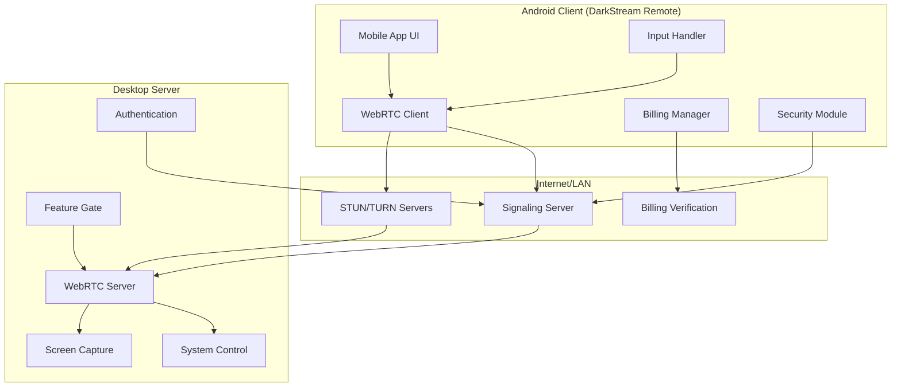
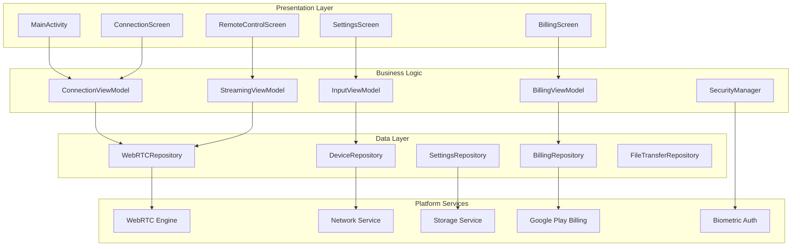
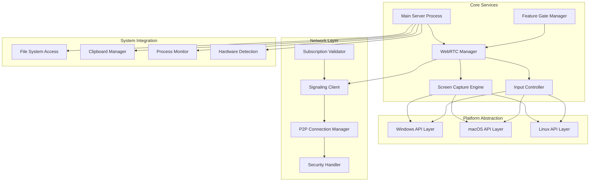
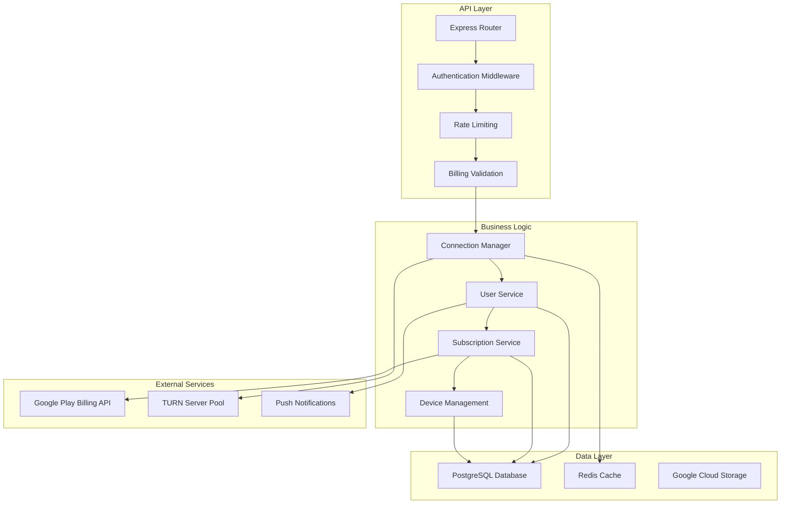
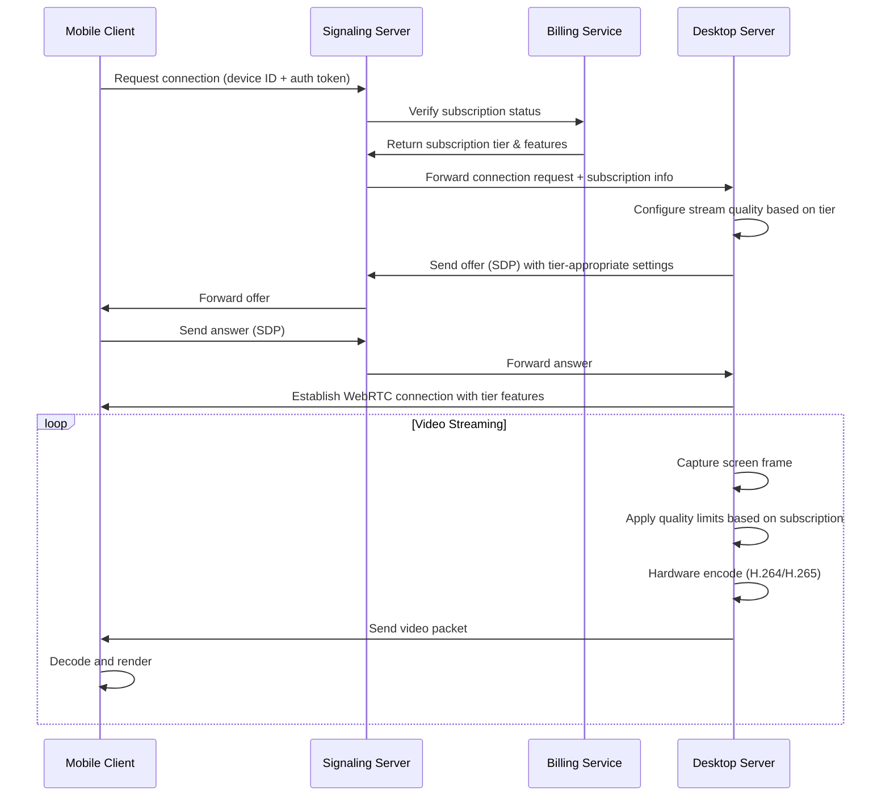
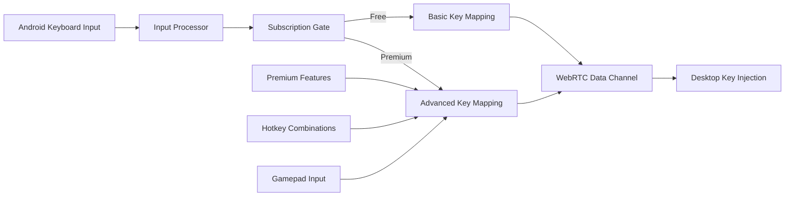
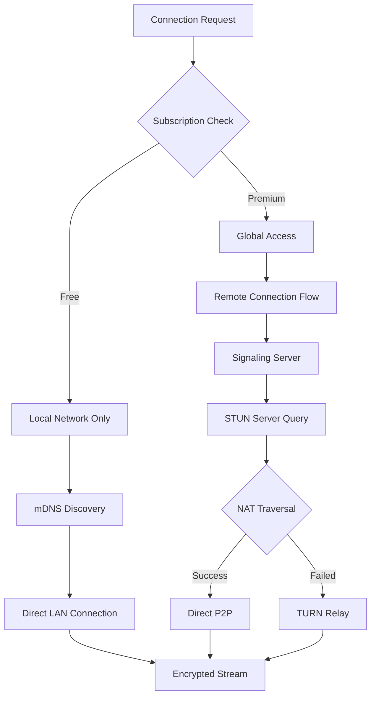
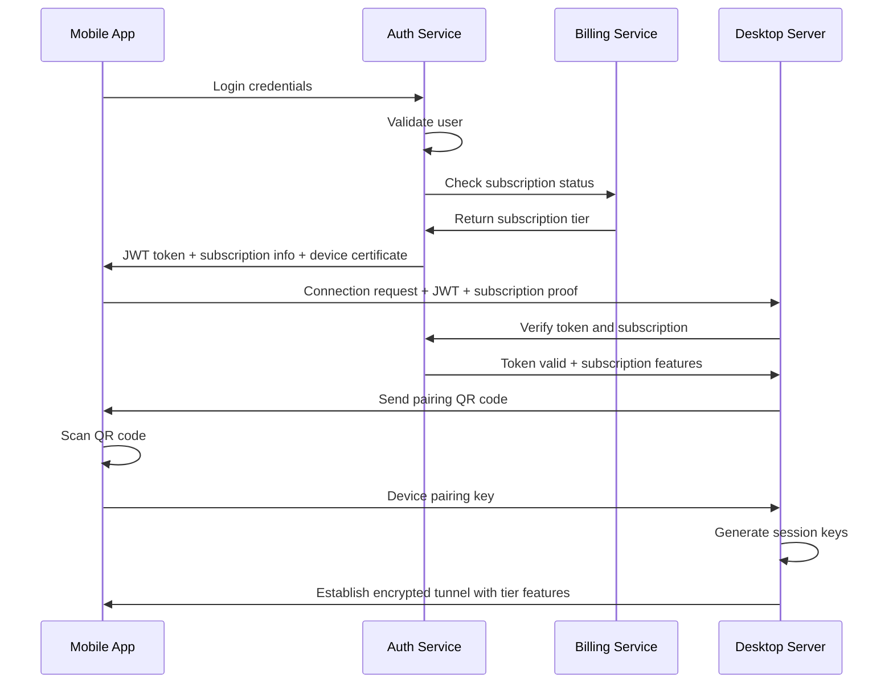
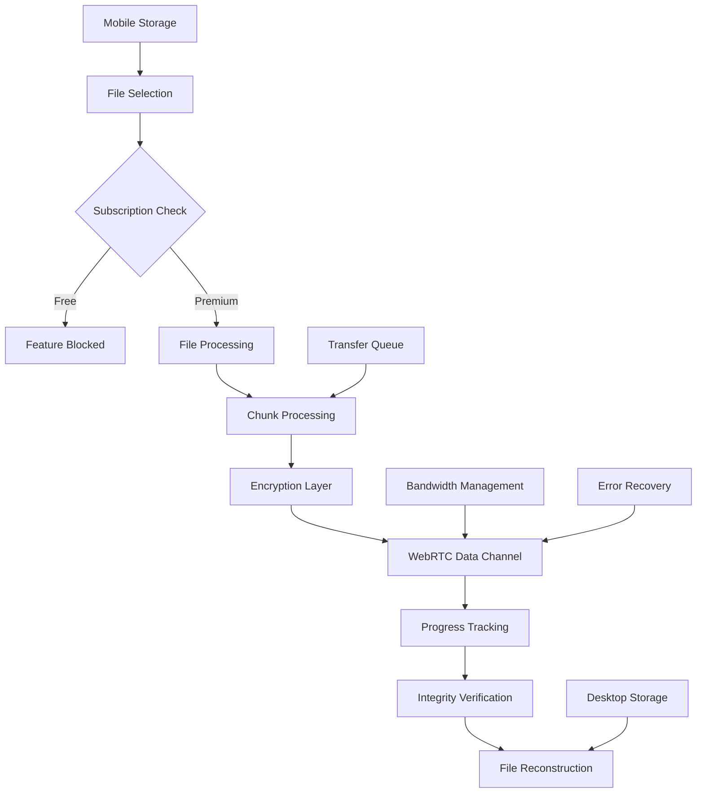

# DarkStream Remote - Commercial Mobile Desktop Control Solution

## Overview

DarkStream Remote is a commercial-grade remote desktop solution that enables users to control their computers directly from Android devices. Built on the foundation of the existing DarkStream-Remote repository (https://github.com/Darkartt/DarkStream-Remote), this application combines low-latency streaming, comprehensive input control, secure global connectivity, and modern design into a market-ready product under the 0xDarkart brand.

### Product Vision
- **Primary Goal**: Professional remote desktop control with commercial distribution
- **Target Market**: Professionals, remote workers, IT administrators, and power users
- **Commercial Model**: Freemium with premium subscription via Google Play Billing
- **Brand Identity**: 0xDarkart - DarkStream Remote premium solution

### Key Value Propositions
- Ultra-low latency desktop streaming with adaptive quality
- Full input control including touch gestures, keyboard, and gamepad
- Secure remote access worldwide with enterprise-grade encryption
- Cross-platform desktop compatibility (Windows, macOS, Linux)
- Modern Material 3 UI with professional branding
- Freemium model with premium subscription features

## Repository Foundation & Development Strategy

### Base Repository Integration
```
Repository: https://github.com/Darkartt/DarkStream-Remote
Status: Empty repository ready for development
Branching Strategy: Git Flow with develop/main branches
CI/CD: GitHub Actions for automated builds and testing

Repository Structure (to be implemented):
DarkStream-Remote/
├── android-client/           # Android Kotlin app
├── desktop-server/          # Cross-platform desktop server
├── signaling-server/        # Node.js signaling service
├── shared/                  # Common protocols and types
├── docs/                    # Documentation and guides
├── scripts/                 # Build and deployment scripts
├── assets/                  # Branding and marketing assets
└── releases/               # Packaged installers and APKs
```

### Development Workflow
```
1. Repository Setup:
   ├── Initialize empty repo with proper structure
   ├── Configure GitHub Actions CI/CD
   ├── Set up development environment documentation
   └── Establish coding standards and guidelines

2. Core Development Phases:
   ├── Phase 1: Android client MVP
   ├── Phase 2: Desktop server implementation
   ├── Phase 3: Signaling server and infrastructure
   ├── Phase 4: Integration and testing
   └── Phase 5: Commercial features and deployment

3. Release Management:
   ├── Semantic versioning (v1.0.0)
   ├── Tagged releases with changelogs
   ├── Automated build artifacts
   └── Play Store deployment pipeline
```

## Technology Stack & Dependencies

### Android Client Application
```
Platform: Android API 24+ (Android 7.0)
Language: Kotlin 100%
UI Framework: Jetpack Compose + Material 3
Architecture: MVVM with Clean Architecture

Core Dependencies:
├── androidx.compose.bom (2024.02.00)
├── androidx.lifecycle.viewmodel-compose
├── androidx.navigation.compose
├── org.webrtc:google-webrtc (1.0.32006)
├── io.ktor:ktor-client-android
├── androidx.camera.camera2
├── androidx.biometric
├── com.android.billingclient:billing-ktx (Google Play Billing)
└── kotlinx.coroutines.android
```

### Desktop Server Application
```
Platform: Cross-platform (Windows 10+, macOS 11+, Ubuntu 20.04+)
Core Language: Rust 1.75+ (for performance and safety)
GUI Framework: Tauri 2.0 (system tray and configuration)
Video Encoding: FFmpeg with hardware acceleration
Installer Generation: Advanced Installer (Windows), create-dmg (macOS), dpkg (Linux)

Core Dependencies:
├── tokio (async runtime)
├── webrtc-rs (WebRTC implementation)
├── ffmpeg-sys-next (video encoding)
├── tauri (desktop framework)
├── serde (serialization)
├── ring (cryptography)
├── windows-rs (Windows APIs)
├── core-foundation (macOS APIs)
└── x11 (Linux X11 APIs)
```

### Signaling Server
```
Platform: Node.js 18+ / Docker containerized
Language: TypeScript
Framework: Express.js + Socket.IO
Database: Redis (session management) + PostgreSQL (user data)

Dependencies:
├── express (4.18+)
├── socket.io (4.7+)
├── jsonwebtoken (9.0+)
├── bcryptjs (2.4+)
├── helmet (security middleware)
├── rate-limiter-flexible
├── prisma (database ORM)
└── @google-cloud/storage
```

### Infrastructure & Cloud Services
```
Video Streaming: WebRTC with STUN/TURN servers
Cloud Provider: Google Cloud Platform (primary) / AWS (backup)
Database: PostgreSQL (Cloud SQL) + Redis (Memorystore)
CDN: Google Cloud CDN
Hosting: Google Cloud Run (containers)
Monitoring: Google Cloud Monitoring + Sentry
Billing: Google Play Billing API integration
```

## Monetization Strategy & Google Play Billing

### Freemium Business Model
```
Free Tier (Local Network Only):
├── Local LAN connection only
├── Basic mouse and keyboard control
├── Standard video quality (720p, 30fps)
├── Single device pairing
├── Basic clipboard sync
└── Community support

Premium Subscription ($9.99/month or $79.99/year):
├── Global internet access (WebRTC + TURN)
├── High-quality streaming (4K, 60fps)
├── Unlimited device pairing
├── File transfer capabilities
├── Advanced gestures and macros
├── Gamepad support
├── Wake-on-LAN
├── Priority support
└── Cloud backup of settings

Enterprise (Future):
├── Team management dashboard
├── Centralized deployment
├── Advanced security policies
├── Custom branding options
└── Dedicated support
```

### Google Play Billing Integration
```kotlin
// Billing implementation structure
class BillingManager {
    private val billingClient: BillingClient
    
    fun initializeBilling() {
        // Setup Play Billing connection
    }
    
    suspend fun purchasePremium(): PurchaseResult {
        // Handle premium subscription purchase
    }
    
    fun verifySubscription(): SubscriptionStatus {
        // Verify active subscription status
    }
}

// Subscription products
val subscriptionProducts = listOf(
    "darkstream_premium_monthly",
    "darkstream_premium_yearly"
)
```

### Revenue Projections
```
Target Metrics (Year 1):
├── Total Downloads: 50,000
├── Free Users: 40,000 (80%)
├── Premium Subscribers: 5,000 (10% conversion)
├── Monthly Revenue: $35,000 (avg $7/user)
├── Annual Revenue: $420,000
└── Growth Rate: 15% monthly
```

## Architecture

### System Architecture Overview



### Repository Structure Implementation
```
DarkStream-Remote/
├── android-client/
│   ├── app/
│   │   ├── src/main/java/com/darkart/darkstream/
│   │   │   ├── ui/                    # Compose UI components
│   │   │   ├── viewmodel/             # MVVM ViewModels
│   │   │   ├── repository/            # Data repositories
│   │   │   ├── network/               # WebRTC and API clients
│   │   │   ├── billing/               # Google Play Billing
│   │   │   ├── security/              # Encryption and auth
│   │   │   └── utils/                 # Helper utilities
│   │   └── build.gradle.kts
│   └── gradle/
│
├── desktop-server/
│   ├── src/
│   │   ├── main.rs                # Entry point
│   │   ├── webrtc/                # WebRTC implementation
│   │   ├── capture/               # Screen capture engine
│   │   ├── input/                 # Input injection
│   │   ├── platform/              # OS-specific code
│   │   └── security/              # Authentication
│   ├── Cargo.toml
│   └── tauri.conf.json
│
├── signaling-server/
│   ├── src/
│   │   ├── server.ts              # Express server
│   │   ├── routes/                # API endpoints
│   │   ├── middleware/            # Auth and validation
│   │   ├── services/              # Business logic
│   │   └── models/                # Database models
│   ├── package.json
│   └── Dockerfile
│
├── shared/
│   ├── protocols/             # Common message formats
│   ├── types/                 # Shared type definitions
│   └── constants/             # App-wide constants
│
├── docs/
│   ├── setup-guide.md
│   ├── api-documentation.md
│   └── troubleshooting.md
│
├── scripts/
│   ├── build-android.sh
│   ├── build-desktop.sh
│   ├── deploy-server.sh
│   └── release.sh
│
├── assets/
│   ├── branding/              # Logos and icons
│   ├── store-assets/          # App Store graphics
│   └── screenshots/           # App screenshots
│
├── releases/
│   ├── android/               # APK/AAB files
│   ├── desktop/               # Installers
│   └── server/                # Docker images
│
├── .github/
│   └── workflows/             # CI/CD pipelines
│
├── LICENSE                   # Proprietary license
├── README.md
└── CONTRIBUTING.md
```

### Component Architecture

#### Android Client Architecture


#### Desktop Server Architecture


#### Signaling Server Architecture


## Core Features & Implementation

### 1. Remote Desktop Streaming with Subscription Tiers

#### Video Stream Configuration by Subscription
| Feature | Free Tier | Premium Tier | Implementation |
|---------|-----------|--------------|----------------|
| Resolution | Max 720p | Up to 4K | Adaptive based on subscription |
| Frame Rate | 15-30 FPS | 30-60 FPS | Server-side enforcement |
| Bitrate | 1-3 Mbps | 1-50 Mbps | Dynamic quality adjustment |
| Codec | H.264 only | H.264/H.265 | Hardware acceleration |
| Network | LAN only | Global access | TURN server access gated |

#### Streaming Engine with Feature Gating


### 2. Input Control System with Premium Features

#### Touch-to-Mouse Mapping (All Tiers)
```
Basic Touch Controls (Free & Premium):
├── Single Tap → Left Click
├── Long Press → Right Click
├── Double Tap → Double Click
├── Drag → Mouse Move
└── Two-finger scroll → Scroll wheel

Premium-Only Gestures:
├── Pinch → Zoom (Ctrl + Mouse wheel)
├── Three-finger swipe → Window switching
├── Four-finger tap → Show desktop
├── Custom macros → Configurable hotkeys
└── Gamepad emulation → Touch gamepad overlay
```

#### Virtual Keyboard Integration


### 3. Connectivity Architecture with Premium Access

#### Connection Modes by Subscription


#### Network Protocols with Access Control
| Protocol | Free Tier | Premium Tier | Usage |
|----------|-----------|--------------|-------|
| WebRTC | LAN only | Global P2P | Video/Audio/Data |
| WebSocket | Limited | Full access | Signaling |
| STUN | Blocked | Enabled | NAT Discovery |
| TURN | Blocked | Enabled | Relay Fallback |

### 4. Security Framework with Commercial Features

#### Authentication Flow with Billing Integration


### 5. Premium Utility Features

#### File Transfer System (Premium Only)


#### Clipboard Synchronization (Premium Feature)
```
Clipboard Sync Events (Premium Only):
├── Mobile Copy → Desktop Paste
├── Desktop Copy → Mobile Paste
├── Image Support → Base64 encoding
├── File Paths → Secure file references
└── Format Conversion → Cross-platform compatibility

Free Tier: Feature disabled with upgrade prompt
```

#### Wake-on-LAN Support (Premium Feature)
```
Wake-on-LAN Implementation:
├── Device Discovery → Store MAC addresses
├── Magic Packet → Send WoL command
├── Status Monitoring → Check wake success
├── Retry Logic → Multiple wake attempts
└── Premium Gate → Subscription verification
```

## Data Models & State Management

### Android Client State Architecture with Billing
```kotlin
// Main application states
sealed class ConnectionState {
    object Disconnected : ConnectionState()
    object Connecting : ConnectionState()
    data class Connected(val sessionId: String, val features: SubscriptionFeatures) : ConnectionState()
    data class Error(val message: String) : ConnectionState()
}

data class SubscriptionFeatures(
    val maxResolution: Resolution = Resolution.HD_720,
    val maxFrameRate: Int = 30,
    val remoteAccess: Boolean = false,
    val fileTransfer: Boolean = false,
    val advancedGestures: Boolean = false,
    val clipboardSync: Boolean = false,
    val wakeOnLan: Boolean = false,
    val gamepadSupport: Boolean = false
)

sealed class SubscriptionState {
    object Free : SubscriptionState()
    data class Premium(val expiresAt: Long) : SubscriptionState()
    object Expired : SubscriptionState()
    object Loading : SubscriptionState()
}

data class StreamingState(
    val isStreaming: Boolean = false,
    val quality: VideoQuality = VideoQuality.AUTO,
    val latency: Long = 0L,
    val bandwidth: Float = 0f,
    val subscriptionLimited: Boolean = false
)

data class DeviceInfo(
    val id: String,
    val name: String,
    val platform: Platform,
    val isOnline: Boolean,
    val lastSeen: Long,
    val capabilities: Set<Capability>,
    val requiresUpgrade: Boolean = false
)

// Google Play Billing integration
data class BillingState(
    val isConnected: Boolean = false,
    val products: List<ProductDetails> = emptyList(),
    val purchases: List<Purchase> = emptyList(),
    val isLoading: Boolean = false,
    val error: String? = null
)
```

### Desktop Server Data Models with Feature Gating
```rust
// Rust data structures
#[derive(Serialize, Deserialize)]
pub struct PeerConnection {
    pub id: String,
    pub device_info: DeviceInfo,
    pub security_context: SecurityContext,
    pub stream_config: StreamConfig,
    pub subscription_features: SubscriptionFeatures,
}

#[derive(Clone, Debug)]
pub struct SubscriptionFeatures {
    pub max_resolution: Resolution,
    pub max_frame_rate: u32,
    pub remote_access: bool,
    pub file_transfer: bool,
    pub advanced_gestures: bool,
    pub clipboard_sync: bool,
    pub wake_on_lan: bool,
    pub gamepad_support: bool,
}

#[derive(Clone)]
pub struct StreamConfig {
    pub resolution: Resolution,
    pub framerate: u32,
    pub bitrate: u32,
    pub codec: VideoCodec,
    pub quality_tier: QualityTier,
}

#[derive(Debug)]
pub enum QualityTier {
    Free,      // 720p, 30fps, local only
    Premium,   // 4K, 60fps, global access
}

pub struct InputEvent {
    pub event_type: InputType,
    pub coordinates: Option<(f32, f32)>,
    pub key_code: Option<u32>,
    pub modifiers: KeyModifiers,
    pub premium_feature: bool, // Gates advanced gestures
}

#[derive(Serialize, Deserialize)]
pub struct FeatureGate {
    pub feature_name: String,
    pub requires_premium: bool,
    pub enabled: bool,
}
```

### Signaling Server Data Models
```typescript
// User and subscription management
interface User {
  id: string;
  email: string;
  createdAt: Date;
  subscriptionTier: SubscriptionTier;
  subscriptionExpiry?: Date;
  devices: Device[];
}

enum SubscriptionTier {
  FREE = 'free',
  PREMIUM = 'premium',
  ENTERPRISE = 'enterprise'
}

interface Device {
  id: string;
  name: string;
  platform: Platform;
  lastSeen: Date;
  capabilities: DeviceCapabilities;
  owner: string; // User ID
}

interface SubscriptionValidation {
  isValid: boolean;
  tier: SubscriptionTier;
  features: SubscriptionFeatures;
  expiresAt?: Date;
  purchaseToken?: string;
}

interface ConnectionSession {
  id: string;
  clientDevice: Device;
  serverDevice: Device;
  subscriptionTier: SubscriptionTier;
  startTime: Date;
  features: SubscriptionFeatures;
  status: SessionStatus;
}
```

## API Integration Layer

### Google Play Billing API Integration
```kotlin
// Billing client implementation
class DarkStreamBillingManager(private val context: Context) {
    private val billingClient: BillingClient
    
    companion object {
        const val PREMIUM_MONTHLY = "darkstream_premium_monthly"
        const val PREMIUM_YEARLY = "darkstream_premium_yearly"
    }
    
    suspend fun initializeBilling(): BillingResult {
        return suspendCoroutine { continuation ->
            billingClient.startConnection(object : BillingClientStateListener {
                override fun onBillingSetupFinished(billingResult: BillingResult) {
                    continuation.resume(billingResult)
                }
                override fun onBillingServiceDisconnected() {
                    // Handle disconnection
                }
            })
        }
    }
    
    suspend fun querySubscriptions(): List<ProductDetails> {
        val productList = listOf(
            QueryProductDetailsParams.Product.newBuilder()
                .setProductId(PREMIUM_MONTHLY)
                .setProductType(BillingClient.ProductType.SUBS)
                .build(),
            QueryProductDetailsParams.Product.newBuilder()
                .setProductId(PREMIUM_YEARLY)
                .setProductType(BillingClient.ProductType.SUBS)
                .build()
        )
        
        val params = QueryProductDetailsParams.newBuilder()
            .setProductList(productList)
            .build()
            
        return billingClient.queryProductDetails(params).productDetailsList ?: emptyList()
    }
    
    fun launchBillingFlow(activity: Activity, productDetails: ProductDetails): BillingResult {
        val billingFlowParams = BillingFlowParams.newBuilder()
            .setProductDetailsParamsList(
                listOf(
                    BillingFlowParams.ProductDetailsParams.newBuilder()
                        .setProductDetails(productDetails)
                        .build()
                )
            )
            .build()
            
        return billingClient.launchBillingFlow(activity, billingFlowParams)
    }
    
    suspend fun verifyPurchase(purchase: Purchase): SubscriptionValidation {
        // Verify with backend server
        return apiClient.verifySubscription(purchase.purchaseToken)
    }
}
```

### WebRTC Signaling Protocol with Subscription Info
```typescript
// Enhanced signaling message types
interface SignalingMessage {
  type: 'offer' | 'answer' | 'ice-candidate' | 'device-info' | 'subscription-update';
  payload: any;
  deviceId: string;
  timestamp: number;
  subscriptionTier?: SubscriptionTier;
}

interface ConnectionOffer {
  sdp: string;
  deviceCapabilities: DeviceCapabilities;
  securityLevel: SecurityLevel;
  subscriptionFeatures: SubscriptionFeatures;
  qualityLimits: QualityLimits;
}

interface QualityLimits {
  maxResolution: Resolution;
  maxFrameRate: number;
  maxBitrate: number;
  codecSupport: VideoCodec[];
}

interface DeviceCapabilities {
  maxResolution: Resolution;
  supportedCodecs: VideoCodec[];
  inputMethods: InputMethod[];
  features: Feature[];
  subscriptionGated: Feature[]; // Features requiring premium
}
```

### REST API Endpoints with Billing Integration
```
Authentication & User Management:
POST /api/v1/auth/login
POST /api/v1/auth/refresh
POST /api/v1/auth/logout
GET /api/v1/user/profile
PUT /api/v1/user/profile

Subscription Management:
POST /api/v1/billing/verify-purchase      # Verify Google Play purchase
GET /api/v1/billing/subscription-status  # Get current subscription
POST /api/v1/billing/webhook             # Google Play webhook
POST /api/v1/billing/cancel              # Cancel subscription
GET /api/v1/billing/features             # Get available features

Device Management:
GET /api/v1/devices                      # List user devices
POST /api/v1/devices/pair                # Pair new device
DELETE /api/v1/devices/{deviceId}        # Remove device
PUT /api/v1/devices/{deviceId}/settings  # Update device settings
GET /api/v1/devices/{deviceId}/features  # Get device-specific features

Session Management:
POST /api/v1/sessions/create             # Create new session
GET /api/v1/sessions/{sessionId}/status  # Session status
DELETE /api/v1/sessions/{sessionId}      # End session
POST /api/v1/sessions/{sessionId}/feature-check # Validate feature access

File Transfer (Premium Only):
POST /api/v1/files/upload                # Upload file
GET /api/v1/files/{fileId}/download      # Download file
GET /api/v1/files/{fileId}/progress      # Transfer progress
DELETE /api/v1/files/{fileId}            # Delete file

Analytics & Usage:
POST /api/v1/analytics/session-start     # Track session start
POST /api/v1/analytics/feature-usage     # Track feature usage
GET /api/v1/analytics/usage-stats        # Get usage statistics
```

### Subscription Validation Middleware
```typescript
// Express middleware for subscription validation
export const validateSubscription = async (
  req: AuthenticatedRequest,
  res: Response,
  next: NextFunction
) => {
  try {
    const userId = req.user.id;
    const subscription = await subscriptionService.getSubscription(userId);
    
    if (!subscription || subscription.status !== 'active') {
      return res.status(403).json({
        error: 'Premium subscription required',
        upgradeUrl: '/premium'
      });
    }
    
    req.subscriptionFeatures = subscription.features;
    next();
  } catch (error) {
    res.status(500).json({ error: 'Subscription validation failed' });
  }
};

// Feature-specific validation
export const requireFeature = (feature: string) => {
  return (req: AuthenticatedRequest, res: Response, next: NextFunction) => {
    if (!req.subscriptionFeatures[feature]) {
      return res.status(403).json({
        error: `Feature '${feature}' requires premium subscription`,
        feature,
        upgradeUrl: '/premium'
      });
    }
    next();
  };
};
```

## Testing Strategy

### Android Application Testing
```
UNIT TESTING (JUnit 5 + Mockk + Robolectric):
├── ViewModels Business Logic:
│   ├── ConnectionViewModel state management
│   ├── BillingViewModel subscription handling
│   ├── StreamingViewModel quality adaptation
│   └── InputViewModel gesture recognition
├── Repository Data Handling:
│   ├── WebRTC connection management
│   ├── Device discovery and pairing
│   ├── Settings persistence
│   └── Billing integration
├── Network Protocol Parsing:
│   ├── Signaling message serialization
│   ├── WebRTC offer/answer handling
│   └── Error response parsing
├── Security & Encryption:
│   ├── Key generation and validation
│   ├── Certificate verification
│   └── Biometric authentication
└── Feature Gating Logic:
    ├── Subscription tier validation
    ├── Premium feature access control
    └── Quality limitation enforcement

INTEGRATION TESTING (Espresso + UI Automator):
├── UI Navigation Flows:
│   ├── Onboarding and setup process
│   ├── Device discovery and connection
│   ├── Remote control interface
│   └── Settings and preferences
├── WebRTC Integration:
│   ├── Peer connection establishment
│   ├── Video stream rendering
│   ├── Input event transmission
│   └── Connection recovery
├── Billing Integration:
│   ├── Google Play Billing flow
│   ├── Subscription verification
│   ├── Feature unlock validation
│   └── Purchase restoration
├── File Transfer Operations:
│   ├── File selection and upload
│   ├── Progress tracking
│   ├── Error handling and retry
│   └── Transfer cancellation
└── Biometric Authentication:
    ├── Fingerprint recognition
    ├── Face unlock integration
    └── Fallback authentication

PERFORMANCE TESTING:
├── Memory Usage Monitoring:
│   ├── Memory leaks in long sessions
│   ├── Bitmap allocation optimization
│   └── WebRTC memory management
├── Battery Consumption Analysis:
│   ├── Screen-on time impact
│   ├── Network activity optimization
│   └── Background processing efficiency
├── Network Performance:
│   ├── Bandwidth usage optimization
│   ├── Adaptive quality effectiveness
│   └── Connection stability metrics
└── Input Latency Measurement:
    ├── Touch to action responsiveness
    ├── Keyboard input delay
    └── Gesture recognition speed
```

### Desktop Server Testing
```rust
// Rust testing framework with comprehensive coverage
#[cfg(test)]
mod tests {
    use super::*;
    use tokio_test;
    
    #[tokio::test]
    async fn test_screen_capture_performance() {
        let capture_engine = ScreenCaptureEngine::new();
        let start = std::time::Instant::now();
        
        let frame = capture_engine.capture_frame().await.unwrap();
        let duration = start.elapsed();
        
        assert!(duration.as_millis() < 16); // 60fps target
        assert!(!frame.data.is_empty());
    }
    
    #[test]
    fn test_input_injection_accuracy() {
        let input_controller = InputController::new();
        
        // Test mouse movement accuracy
        let result = input_controller.inject_mouse_move(100, 200);
        assert!(result.is_ok());
        
        // Test keyboard input
        let result = input_controller.inject_key_press(VirtualKey::A);
        assert!(result.is_ok());
    }
    
    #[test]
    fn test_subscription_feature_gating() {
        let features = SubscriptionFeatures {
            max_resolution: Resolution::HD_720,
            remote_access: false,
            file_transfer: false,
            ..Default::default()
        };
        
        let gate = FeatureGate::new(features);
        
        assert!(!gate.is_feature_enabled("file_transfer"));
        assert!(!gate.is_feature_enabled("remote_access"));
        assert!(gate.is_resolution_allowed(Resolution::HD_720));
        assert!(!gate.is_resolution_allowed(Resolution::UHD_4K));
    }
    
    #[test]
    fn test_security_key_exchange() {
        let mut device_a = SecurityContext::new();
        let mut device_b = SecurityContext::new();
        
        let (public_a, private_a) = device_a.generate_keypair();
        let (public_b, private_b) = device_b.generate_keypair();
        
        let shared_secret_a = device_a.derive_shared_secret(&public_b, &private_a);
        let shared_secret_b = device_b.derive_shared_secret(&public_a, &private_b);
        
        assert_eq!(shared_secret_a, shared_secret_b);
    }
    
    #[tokio::test]
    async fn test_webrtc_connection_establishment() {
        let server = WebRTCServer::new().await;
        let offer = server.create_offer().await.unwrap();
        
        assert!(!offer.sdp.is_empty());
        assert!(offer.sdp.contains("a=setup:actpass"));
    }
}

// Benchmark tests for performance critical components
#[cfg(test)]
mod benchmarks {
    use super::*;
    use criterion::{black_box, criterion_group, criterion_main, Criterion};
    
    fn benchmark_screen_capture(c: &mut Criterion) {
        let rt = tokio::runtime::Runtime::new().unwrap();
        let capture_engine = rt.block_on(ScreenCaptureEngine::new());
        
        c.bench_function("screen_capture", |b| {
            b.iter(|| {
                rt.block_on(capture_engine.capture_frame())
            })
        });
    }
    
    fn benchmark_video_encoding(c: &mut Criterion) {
        let encoder = VideoEncoder::new(VideoCodec::H264).unwrap();
        let test_frame = create_test_frame(1920, 1080);
        
        c.bench_function("h264_encoding", |b| {
            b.iter(|| {
                encoder.encode_frame(black_box(&test_frame))
            })
        });
    }
    
    criterion_group!(benches, benchmark_screen_capture, benchmark_video_encoding);
    criterion_main!(benches);
}
```

### End-to-End Testing & Quality Assurance
```
AUTOMATED E2E TESTING PIPELINE:
├── Device Pairing Scenarios:
│   ├── QR code generation and scanning
│   ├── PIN-based pairing fallback
│   ├── Multiple device management
│   └── Device removal and re-pairing
├── Network Condition Simulation:
│   ├── High latency connections (200ms+)
│   ├── Low bandwidth scenarios (<1Mbps)
│   ├── Packet loss simulation (1-5%)
│   ├── Network switching (WiFi ↔ Cellular)
│   └── Connection interruption recovery
├── Firewall Traversal Testing:
│   ├── Symmetric NAT environments
│   ├── Corporate firewall scenarios
│   ├── TURN server fallback validation
│   └── Port restriction handling
├── Multi-Platform Compatibility:
│   ├── Windows 10/11 desktop server
│   ├── macOS Monterey/Ventura/Sonoma
│   ├── Ubuntu 20.04/22.04 LTS
│   ├── Android 7.0 - 14.0 client
│   └── Various device resolutions
├── Security Penetration Testing:
│   ├── Man-in-the-middle attack prevention
│   ├── Certificate validation bypass attempts
│   ├── Subscription verification spoofing
│   ├── Input injection attack prevention
│   └── Unauthorized access attempts
└── Performance Benchmarking:
    ├── Latency measurements across regions
    ├── Throughput optimization validation
    ├── Resource usage profiling
    ├── Battery life impact assessment
    └── Concurrent connection handling

MANUAL TESTING CHECKLIST:
├── User Experience Testing:
│   ├── First-time user onboarding flow
│   ├── Subscription upgrade experience
│   ├── Error message clarity and helpfulness
│   ├── UI responsiveness and smoothness
│   └── Accessibility compliance (TalkBack, etc.)
├── Feature Validation:
│   ├── All gesture controls work accurately
│   ├── File transfer completes successfully
│   ├── Clipboard sync functions properly
│   ├── Wake-on-LAN activates correctly
│   └── Premium features gate correctly
├── Real-World Usage Scenarios:
│   ├── Work-from-home productivity tasks
│   ├── IT support and troubleshooting
│   ├── Creative work and design tasks
│   ├── Gaming and entertainment use
│   └── Educational and presentation scenarios
└── App Store Compliance:
    ├── Google Play policy adherence
    ├── Privacy policy implementation
    ├── Subscription terms compliance
    ├── Content rating accuracy
    └── Metadata and description verification
```

## Legal and Compliance Infrastructure

### Comprehensive EULA for Remote Desktop Software
```
END USER LICENSE AGREEMENT (EULA) - DarkStream Remote
0xDarkart Proprietary Remote Desktop Software License v1.0

IMPORTANT - READ CAREFULLY: This End User License Agreement ("EULA") is a legal 
agreement between you ("User") and 0xDarkart ("Company") for the DarkStream Remote 
software including computer software and associated media and printed materials 
("Software").

SECTION 1: GRANT OF LICENSE
1.1 License Grant: Subject to the terms of this EULA, Company grants User a 
non-exclusive, non-transferable license to install and use the Software on 
Android devices and desktop computers owned or controlled by User.

1.2 Remote Desktop Specific Terms:
- User may establish remote connections only to computers owned or 
  legally controlled by User
- Unauthorized access to third-party computers is strictly prohibited
- User is responsible for ensuring remote access compliance with local laws
- Corporate/enterprise use requires separate commercial licensing

1.3 Subscription Terms:
- Free tier limited to local network connections
- Premium features require active subscription through Google Play Store
- Subscription auto-renewal governed by Google Play policies
- Service availability subject to network conditions and infrastructure

SECTION 2: RESTRICTIONS
2.1 Prohibited Activities:
- Reverse engineering, decompiling, or disassembling the Software
- Circumventing subscription verification or feature gating mechanisms
- Using the Software for unauthorized access to third-party systems
- Redistributing, selling, or sublicensing the Software
- Removing or modifying copyright notices or branding elements

2.2 Security Compliance:
- User must maintain reasonable security measures on controlled devices
- User responsible for securing network infrastructure and access credentials
- Reporting security vulnerabilities to Company within 24 hours of discovery

2.3 Data Protection:
- User acknowledges data transmission occurs during remote desktop sessions
- User responsible for compliance with applicable data protection laws
- Company implements encryption but User responsible for data governance

SECTION 3: INTELLECTUAL PROPERTY
3.1 Ownership: All rights, title, and interest in the Software belong to 0xDarkart
3.2 Trademarks: DarkStream Remote™ and 0xDarkart™ are registered trademarks
3.3 Patents: Software may be protected by issued and pending patents

SECTION 4: LIABILITY AND WARRANTIES
4.1 Disclaimer: Software provided "AS IS" without warranties of any kind
4.2 Remote Access Risks: User acknowledges inherent security risks in remote access
4.3 Limitation of Liability: Company not liable for unauthorized access, data breaches, 
    or damages resulting from remote desktop usage
4.4 Indemnification: User indemnifies Company against claims arising from 
    unauthorized or improper use

SECTION 5: TERMINATION
5.1 Automatic Termination: License terminates upon breach of terms
5.2 Effect of Termination: User must cease use and delete all Software copies
5.3 Survival: Sections 3, 4, and 6 survive termination

SECTION 6: GOVERNING LAW
This EULA governed by laws of [JURISDICTION] without conflict of law principles.

By installing or using the Software, User agrees to be bound by this EULA.
```

### Terms of Service for Remote Access Liability
```
DARKSTREAM REMOTE TERMS OF SERVICE
Effective Date: [DATE]
Last Updated: [DATE]

SECTION 1: ACCEPTANCE AND SCOPE
1.1 These Terms govern use of DarkStream Remote services
1.2 By creating an account, User agrees to these Terms
1.3 Terms apply to all service components: mobile app, desktop software, cloud services

SECTION 2: REMOTE ACCESS RESPONSIBILITIES
2.1 Authorized Use Only:
- User may only access computers under their ownership or explicit authorization
- User must obtain permission from computer owners before establishing connections
- Corporate environments require IT administrator approval
- User responsible for verifying legal right to access target systems

2.2 Security Obligations:
- User must implement strong authentication on all controlled devices
- Regular security updates required on desktop server software
- Network security (firewalls, VPNs) User's responsibility
- Immediate reporting of suspected unauthorized access

2.3 Data Security:
- User acknowledges data transmission during remote sessions
- End-to-end encryption provided but User responsible for data classification
- Sensitive data transmission subject to User's risk assessment
- Company not liable for data exposure during transmission

SECTION 3: SERVICE AVAILABILITY AND LIMITATIONS
3.1 Service Level:
- 99.9% uptime target for cloud infrastructure
- Network conditions may affect connection quality
- Maintenance windows scheduled with advance notice
- Force majeure events may interrupt service

3.2 Usage Limitations:
- Free tier: Local network connections only
- Premium tier: Unlimited global connections subject to fair use
- Concurrent connection limits based on subscription tier
- Bandwidth throttling during peak usage periods

SECTION 4: LIABILITY LIMITATIONS
4.1 No Warranty for Security:
- User acknowledges inherent risks in remote desktop technology
- Company provides security measures but cannot guarantee breach prevention
- User assumes risk of unauthorized access to remote systems

4.2 Limitation of Damages:
- Company liability limited to subscription fees paid in preceding 12 months
- No liability for indirect, consequential, or punitive damages
- User responsible for backup and data protection strategies

4.3 Indemnification:
- User indemnifies Company against third-party claims
- User responsible for compliance with applicable laws and regulations
- User liable for unauthorized access claims resulting from service misuse

SECTION 5: PRIVACY AND DATA PROTECTION
5.1 Data Collection governed by Privacy Policy
5.2 User consents to data processing for service provision
5.3 Data retention periods specified in Privacy Policy
5.4 User rights include access, correction, and deletion of personal data

SECTION 6: SUBSCRIPTION AND BILLING
6.1 Google Play Billing: All transactions processed through Google Play Store
6.2 Refund Policy: Governed by Google Play refund policies
6.3 Price Changes: 30-day advance notice for subscription price modifications
6.4 Subscription Cancellation: Effective at end of current billing period

SECTION 7: MODIFICATION AND TERMINATION
7.1 Service Modifications: Company may modify features with reasonable notice
7.2 Account Termination: Company may terminate accounts for Terms violations
7.3 Data Export: User may export account data before termination
7.4 Survival: Privacy, liability, and intellectual property provisions survive

Contact: legal@0xdarkart.com for Terms-related inquiries
```

### GDPR-Compliant Privacy Policy
```
DARKSTREAM REMOTE PRIVACY POLICY
0xDarkart Data Protection and Privacy Notice

Effective Date: [DATE]
Last Updated: [DATE]

SECTION 1: INTRODUCTION AND LEGAL BASIS
1.1 Data Controller: 0xDarkart, [COMPANY ADDRESS]
1.2 Contact: privacy@0xdarkart.com, Data Protection Officer
1.3 Legal Basis: Legitimate interests, contract performance, legal compliance
1.4 Geographic Scope: Global with GDPR compliance for EU users

SECTION 2: DATA COLLECTION AND PROCESSING
2.1 Account Information:
- Email address (required for account creation)
- Device identifiers (Android ID, hardware specs)
- Subscription status and billing information
- Legal Basis: Contract performance
- Retention: Duration of account plus 7 years for financial records

2.2 Technical Data:
- IP addresses and network information
- Connection logs and session metadata
- Performance metrics (latency, bandwidth usage)
- Crash reports and diagnostic information
- Legal Basis: Legitimate interests (service improvement, security)
- Retention: 90 days for logs, 2 years for analytics

2.3 Remote Desktop Session Data:
- Connection establishment logs
- Quality metrics and performance data
- Device pairing information
- File transfer metadata (NOT file contents)
- Legal Basis: Contract performance
- Retention: 30 days for operational data

2.4 Usage Analytics:
- Feature usage patterns
- App interaction data
- Session duration and frequency
- A/B testing participation
- Legal Basis: Legitimate interests (product improvement)
- Retention: 24 months anonymized

SECTION 3: DATA SHARING AND THIRD PARTIES
3.1 No Sale of Personal Data: We do not sell personal information

3.2 Service Providers:
- Google Cloud Platform (infrastructure hosting)
- Google Play Store (payment processing)
- Sentry (error tracking and monitoring)
- Purpose: Service provision and technical operations
- Safeguards: Data processing agreements, encryption in transit/rest

3.3 Legal Disclosure:
- Law enforcement requests with valid legal process
- Protection of rights and safety
- Business transfers (with notice to affected users)

SECTION 4: REMOTE ACCESS AND SECURITY MEASURES
4.1 Encryption:
- End-to-end encryption using AES-256 for all data streams
- WebRTC DTLS for real-time communication
- TLS 1.3 for signaling and control channels

4.2 Access Controls:
- Biometric authentication on supported devices
- PKI-based device pairing with certificate validation
- Session timeout and automatic disconnection

4.3 Data Minimization:
- Screen content not stored or logged
- Keyboard input not recorded beyond operational necessity
- File transfer temporary caching only

SECTION 5: USER RIGHTS (GDPR COMPLIANCE)
5.1 Right of Access: Request copy of personal data
5.2 Right to Rectification: Correct inaccurate information
5.3 Right to Erasure: Delete personal data ("right to be forgotten")
5.4 Right to Restrict Processing: Limit data processing
5.5 Right to Data Portability: Export data in machine-readable format
5.6 Right to Object: Opt-out of legitimate interest processing
5.7 Rights regarding Automated Decision-Making: Not applicable

Exercise Rights: privacy@0xdarkart.com with identity verification
Response Time: 30 days maximum

SECTION 6: INTERNATIONAL DATA TRANSFERS
6.1 Primary Processing: European Economic Area (EEA)
6.2 US Processing: Google Cloud with Standard Contractual Clauses
6.3 Adequacy Decisions: Processing in countries with EU adequacy status
6.4 Safeguards: Binding corporate rules, certification schemes

SECTION 7: DATA SECURITY MEASURES
7.1 Encryption at Rest: AES-256 for all stored data
7.2 Network Security: TLS 1.3, certificate pinning
7.3 Access Controls: Multi-factor authentication, role-based access
7.4 Monitoring: 24/7 security monitoring and incident response
7.5 Data Breach Response: Notification within 72 hours of discovery

SECTION 8: CHILDREN'S PRIVACY
8.1 Age Requirement: 13+ years (16+ in EU)
8.2 Parental Consent: Required for users under applicable age limits
8.3 Special Protections: Enhanced privacy measures for minor users

SECTION 9: POLICY UPDATES
9.1 Material Changes: 30-day advance notice via email
9.2 Continued Use: Constitutes acceptance of updated policy
9.3 Objection Right: Users may delete account if disagreeing with changes

SECTION 10: SUPERVISORY AUTHORITY
EU users may lodge complaints with:
- Local data protection authority
- Lead supervisory authority: [RELEVANT DPA]
- European Data Protection Board (edpb.europa.eu)

Contact Information:
Data Protection Officer: dpo@0xdarkart.com
Privacy Inquiries: privacy@0xdarkart.com
Mailing Address: [COMPANY ADDRESS]
Phone: [CONTACT NUMBER]
```

### Intellectual Property Documentation
```
DARKSTREAM REMOTE INTELLECTUAL PROPERTY FRAMEWORK

COPYRIGHT REGISTRATION:
Work Title: DarkStream Remote Software Suite
Author/Owner: 0xDarkart
Creation Date: [DATE]
Registration: [COPYRIGHT REGISTRATION NUMBER]

Copyright Notice Template:
"Copyright © 2024 0xDarkart. All rights reserved. DarkStream Remote and 
the 0xDarkart logo are trademarks of 0xDarkart. Unauthorized reproduction 
or distribution is prohibited."

TRADEMARK PORTFOLIO:
1. DarkStream Remote™
   - Class 9: Computer software for remote desktop access
   - Class 42: Software as a service featuring remote desktop technology
   - Registration Status: [PENDING/REGISTERED]
   
2. 0xDarkart™
   - Class 9: Computer software and mobile applications
   - Class 42: Technology services and software development
   - Registration Status: [PENDING/REGISTERED]

3. Logo and Design Marks:
   - App icon and visual identity elements
   - Brand colors and typography combinations
   - Marketing materials and graphics

SOURCE CODE PROTECTION:
- Proprietary code repositories with access controls
- Employee confidentiality and invention assignment agreements
- Contractor intellectual property transfer agreements
- Open source license compliance documentation

PATENT CONSIDERATIONS:
1. "Method for Adaptive Quality Remote Desktop Streaming"
   - Novel compression algorithms for mobile-to-desktop streaming
   - Priority Date: [DATE]
   - Status: [PROVISIONAL/FILED/PENDING]

2. "Secure Multi-Factor Device Pairing for Remote Access"
   - PKI-based authentication with biometric integration
   - Priority Date: [DATE]
   - Status: [PROVISIONAL/FILED/PENDING]

3. "Cross-Platform Input Mapping for Touch-to-Desktop Control"
   - Gesture recognition and input translation methods
   - Priority Date: [DATE]
   - Status: [PROVISIONAL/FILED/PENDING]

LICENSE ENFORCEMENT:
- Digital rights management integration
- Subscription verification mechanisms
- Anti-tampering and obfuscation measures
- DMCA takedown procedures for unauthorized distribution
```

### Commercial License Templates
```
COMMERCIAL LICENSING FRAMEWORK

ENTERPRISE LICENSE AGREEMENT TEMPLATE:

SECTION 1: GRANT OF RIGHTS
1.1 Enterprise Deployment Rights:
- Installation on unlimited corporate devices
- Centralized management and configuration
- Custom branding and white-label options
- Priority technical support and SLA guarantees

1.2 Usage Restrictions:
- Licensed entity and subsidiaries only
- No redistribution to third parties
- Compliance with export control regulations
- Audit rights for license compliance verification

SECTION 2: MONETIZATION CLAUSES
2.1 Revenue Sharing Model:
- Base licensing fee: $X per user per month
- Revenue sharing: Y% of customer subscription fees
- Minimum commitment: $Z annually
- Payment terms: Net 30 days

2.2 Distribution Rights:
- Geographic territory restrictions
- Channel partner requirements
- Marketing and sales obligations
- Performance benchmarks and penalties

OEM PARTNERSHIP AGREEMENT TEMPLATE:

SECTION 1: DISTRIBUTION RIGHTS
1.1 Pre-Installation Rights:
- Bundle with hardware devices
- Custom configuration profiles
- Co-branded marketing materials
- Technical integration support

1.2 Revenue Model:
- Per-device licensing fee
- Subscription revenue sharing
- Support fee structure
- Volume discount tiers

RESTRICTIONS AND COMPLIANCE:
- Quality standards and certification requirements
- Brand guidelines and trademark usage
- Technical support responsibilities
- Termination clauses and IP protection
```

### Google Play Store Developer Compliance
```
DEVELOPER ACCOUNT VERIFICATION REQUIREMENTS:

1. Business Registration:
   ├── D-U-N-S Number: Required for business verification
   ├── Business Documents: Articles of incorporation, tax ID
   ├── Identity Verification: Government-issued ID for all admins
   ├── Address Verification: Utility bills or bank statements
   └── Phone Verification: Business phone number confirmation

2. Developer Console Setup:
   ├── Organization Account: 0xDarkart business entity
   ├── Payment Profile: Business banking information
   ├── Tax Information: W-9 or W-8 forms as applicable
   ├── App Signing: Google Play App Signing enrollment
   └── Release Management: Production track configuration

3. Policy Compliance Documentation:
   ├── Remote Desktop Policy: Acceptable use guidelines
   ├── Permissions Justification: Detailed explanations
   ├── Security Attestation: Security review completion
   └── Content Rating: IARC questionnaire completion
```

### Mandatory Data Safety Section
```
DATA SAFETY DISCLOSURE (Google Play Store):

1. Data Types Collected:
   ├── Personal Info: Email addresses
   ├── Device Info: Device identifiers, hardware specs
   ├── App Activity: In-app actions, feature usage
   ├── App Info: Crash logs, diagnostics
   └── Financial Info: Purchase history, subscription status

2. Data Usage Purposes:
   ├── App Functionality: Core remote desktop features
   ├── Analytics: Usage patterns and performance metrics
   ├── Developer Communications: Support and updates
   ├── Advertising: None - no third-party advertising
   └── Account Management: Subscription and billing

3. Data Sharing Practices:
   ├── Third Parties: Google Play Billing only
   ├── Service Providers: Cloud infrastructure partners
   ├── Legal Requirements: Law enforcement requests only
   └── No Data Sales: Explicit statement of no data selling

4. Security Measures:
   ├── Data Encryption: In transit and at rest
   ├── Access Controls: Role-based access limitations
   ├── Secure Transmission: HTTPS and TLS protocols
   └── Data Deletion: User-initiated deletion capability

5. User Controls:
   ├── Opt-out Options: Analytics and marketing communications
   ├── Data Access: Export personal data functionality
   ├── Data Correction: In-app profile editing
   └── Account Deletion: Complete data removal option
```

### Android API Compliance Roadmap
```
TARGET API LEVEL COMPLIANCE:

Current Requirements (2024):
├── Target SDK: Android 14 (API level 34)
├── Minimum SDK: Android 7.0 (API level 24)
├── Compile SDK: Android 14 (API level 34)
└── Compliance Deadline: Immediate for new apps

Upcoming Requirements (August 31, 2025):
├── Target SDK: Android 15 (API level 35) - MANDATORY
├── New Privacy Features: Enhanced permission controls
├── Security Updates: Additional runtime protections
├── Performance Requirements: Battery and memory optimizations
└── Migration Timeline: 6 months before deadline

API Migration Strategy:
├── Q1 2025: Begin Android 15 beta testing
├── Q2 2025: Complete API migration and testing
├── Q3 2025: Submit updated app for review
├── Q4 2025: Full compliance and deployment
└── Continuous: Monitor new API requirements

Breaking Changes Preparation:
├── Permission Changes: Adapt to new runtime permissions
├── Background Restrictions: Optimize background services
├── Security Enhancements: Implement new security APIs
└── Performance Monitoring: Track impact of changes
```

### App Bundle (AAB) Implementation
```
ANDROID APP BUNDLE REQUIREMENTS:

1. Technical Specifications:
   ├── Format: .aab (Android App Bundle) - MANDATORY
   ├── Dynamic Delivery: Modularized app components
   ├── Asset Packs: Large resources delivered on-demand
   ├── Feature Modules: Optional functionality modules
   └── Language Packs: Localized resources optimization

2. Build Configuration:
```gradle
// app/build.gradle.kts
android {
    bundle {
        language {
            enableSplit = true
        }
        density {
            enableSplit = true
        }
        abi {
            enableSplit = true
        }
    }
    
    // Dynamic feature modules
    dynamicFeatures = mutableSetOf(
        ":premium-features",
        ":file-transfer",
        ":advanced-gestures"
    )
}
```

3. Optimization Benefits:
   ├── Size Reduction: 15-20% smaller downloads
   ├── Faster Installs: Progressive feature delivery
   ├── Storage Efficiency: Device-specific optimizations
   └── Update Efficiency: Incremental updates only

4. Testing Strategy:
   ├── Internal Testing: bundletool validation
   ├── Device Testing: Multiple Android versions and devices
   ├── Performance Testing: Installation and update speeds
   └── Feature Testing: Dynamic module loading verification
```
```
DarkStream Remote Commercial License v1.0

Copyright (c) 2024 0xDarkart. All rights reserved.

GRANT OF LICENSE:
Subject to the terms of this license, 0xDarkart grants end users a 
non-exclusive, non-transferable license to use DarkStream Remote software.

Commercial distribution and marketing rights are exclusively retained by 0xDarkart.

RESTRICTIONS:
- No redistribution of source code or binaries
- No reverse engineering or decompilation
- No creation of derivative works
- No commercial use without separate licensing agreement
- No removal of copyright notices or branding

OWNERSHIP:
All intellectual property rights, including but not limited to copyrights,
trademarks, and trade secrets, belong exclusively to 0xDarkart.

DarkStream Remote™ is a trademark of 0xDarkart.

MONETIZATION:
0xDarkart retains exclusive rights to:
- Set pricing and subscription models
- Distribute through app stores
- License to enterprise customers
- Modify or discontinue service

LIABILITY:
Software provided "as is" without warranties. 0xDarkart not liable
for damages from use of this software.
```

## Advanced Security and Encryption Implementation

### Comprehensive Security Architecture
```
END-TO-END ENCRYPTION FRAMEWORK:

1. Multi-Layer Encryption:
   ├── Application Layer: AES-256-GCM for all application data
   ├── Transport Layer: TLS 1.3 for signaling and control
   ├── WebRTC Layer: DTLS 1.2 + SRTP for media streams
   ├── Session Layer: ChaCha20-Poly1305 for session keys
   └── Storage Layer: AES-256-XTS for data at rest

2. Key Management Infrastructure:
   ├── Key Derivation: PBKDF2 with 100,000 iterations
   ├── Key Exchange: ECDH with P-384 curve
   ├── Key Rotation: Automatic 24-hour rotation for session keys
   ├── Key Storage: Android Keystore / Platform secure enclave
   └── Key Escrow: No key escrow - zero-knowledge architecture

3. Perfect Forward Secrecy:
   ├── Ephemeral Keys: Generate new keys for each session
   ├── Key Destruction: Automatic key deletion after session end
   ├── Session Isolation: Each session cryptographically independent
   └── Compromise Recovery: Past sessions remain secure
```

### Multi-Factor Authentication System
```
AUTHENTICATION LAYER IMPLEMENTATION:

1. Primary Authentication (Required):
   ├── Email/Password: Strong password requirements (12+ chars)
   ├── Account Verification: Email confirmation required
   ├── Password Security: bcrypt with salt, 12 rounds
   └── Rate Limiting: Failed login attempt protection

2. Device Pairing (Required):
   ├── QR Code Method: ECDSA-signed pairing tokens
   ├── PIN Method: 8-digit cryptographically secure PINs
   ├── Certificate Exchange: X.509v3 device certificates
   ├── Mutual Authentication: Both devices verify each other
   └── Trust-on-First-Use: Enhanced with certificate pinning

3. Biometric Authentication (Premium):
   ├── Android Biometric API: Fingerprint, face, voice
   ├── Hardware Security: TEE/Secure Element integration
   ├── Fallback Options: PIN/password backup authentication
   ├── Privacy Protection: Biometric data never leaves device
   └── Template Protection: Anti-spoofing measures

4. Advanced MFA Options:
   ├── TOTP Integration: Google Authenticator compatibility
   ├── Hardware Keys: FIDO2/WebAuthn support
   ├── Push Notifications: Out-of-band verification
   └── Risk-Based Auth: Adaptive authentication based on context
```

### PKI Infrastructure for Device Authentication
```
CERTIFICATE-BASED AUTHENTICATION:

1. Certificate Authority Structure:
   ├── Root CA: 0xDarkart Root Certificate Authority
   ├── Intermediate CA: DarkStream Device Certification Authority
   ├── Device Certificates: Unique per-device certificates
   ├── User Certificates: Per-user authentication certificates
   └── Session Certificates: Ephemeral certificates for sessions

2. Certificate Lifecycle Management:
   ├── Issuance: Automated certificate generation during pairing
   ├── Validation: Real-time certificate status verification
   ├── Renewal: Automatic renewal 30 days before expiration
   ├── Revocation: Immediate revocation for compromised devices
   └── OCSP: Online Certificate Status Protocol support

3. Implementation Details:
```java
// Android Certificate Management
public class DarkStreamCertificateManager {
    private static final String CERTIFICATE_ALIAS = "darkstream_device_cert";
    private static final String KEY_ALGORITHM = "EC";
    private static final int KEY_SIZE = 384; // P-384 curve
    
    public KeyPair generateDeviceKeyPair() throws Exception {
        KeyPairGenerator keyGen = KeyPairGenerator.getInstance(
            KeyProperties.KEY_ALGORITHM_EC, "AndroidKeyStore");
        
        KeyGenParameterSpec spec = new KeyGenParameterSpec.Builder(
            CERTIFICATE_ALIAS,
            KeyProperties.PURPOSE_SIGN | KeyProperties.PURPOSE_VERIFY)
            .setAlgorithmParameterSpec(new ECGenParameterSpec("secp384r1"))
            .setDigests(KeyProperties.DIGEST_SHA256, KeyProperties.DIGEST_SHA384)
            .setUserAuthenticationRequired(true)
            .setUserAuthenticationValidityDurationSeconds(300)
            .build();
        
        keyGen.initialize(spec);
        return keyGen.generateKeyPair();
    }
    
    public X509Certificate createDeviceCertificate(KeyPair keyPair, 
            String deviceId) throws Exception {
        // Certificate creation logic with device-specific attributes
        X500Principal subject = new X500Principal(
            "CN=" + deviceId + ",O=0xDarkart,C=US");
        
        // Certificate valid for 1 year with auto-renewal
        Date notBefore = new Date();
        Date notAfter = new Date(notBefore.getTime() + 365L * 24 * 60 * 60 * 1000);
        
        return generateCertificate(subject, keyPair, notBefore, notAfter);
    }
}
```

### Remote Desktop Security Measures (18+ Protocols)
```
REMOTE ACCESS SECURITY PROTOCOLS:

1. Connection Security:
   ├── TLS 1.3 Exclusive: No fallback to older protocols
   ├── Certificate Pinning: Prevent MITM attacks
   ├── HSTS Headers: HTTP Strict Transport Security
   ├── Perfect Forward Secrecy: ECDHE key exchange
   └── Cipher Suite Restrictions: Only AEAD ciphers allowed

2. Authentication Protocols:
   ├── Mutual TLS: Both client and server authentication
   ├── SAML 2.0: Enterprise SSO integration
   ├── OAuth 2.0: Secure token-based authentication
   ├── JWT Tokens: Signed with RS256 algorithm
   └── Device Attestation: Hardware-backed device verification

3. Session Security:
   ├── Session Timeout: Configurable idle timeout (default 30 min)
   ├── Concurrent Session Limits: Max 3 active sessions per user
   ├── Session Binding: IP address and device fingerprinting
   ├── Auto-Lock: Automatic screen lock during inactivity
   └── Session Hijacking Protection: Token rotation and validation

4. Network Security:
   ├── VPN Compatibility: Works through corporate VPNs
   ├── Firewall Traversal: Smart NAT and firewall detection
   ├── DDoS Protection: Rate limiting and traffic analysis
   ├── Geographic Restrictions: IP-based access controls
   └── Network Anomaly Detection: Unusual traffic pattern alerts

5. Data Protection:
   ├── Screen Content Encryption: Real-time frame encryption
   ├── Keyboard Input Protection: Encrypted keystroke transmission
   ├── Clipboard Security: Encrypted clipboard synchronization
   ├── File Transfer Encryption: AES-256 for file transfers
   └── Memory Protection: Sensitive data cleared from memory

6. Access Controls:
   ├── Role-Based Access: Admin/user permission levels
   ├── Time-Based Access: Scheduled access windows
   ├── Feature Permissions: Granular feature access controls
   ├── Audit Logging: Comprehensive access and action logs
   └── Privilege Escalation Prevention: Least privilege principle

7. Threat Detection:
   ├── Brute Force Protection: Progressive delays and lockouts
   ├── Intrusion Detection: Anomalous behavior monitoring
   ├── Malware Scanning: File transfer virus scanning
   ├── Social Engineering Protection: Warning systems
   └── Insider Threat Monitoring: User behavior analytics

8. Compliance Protocols:
   ├── FIPS 140-2: Cryptographic module standards
   ├── Common Criteria: Security evaluation standards
   ├── NIST Cybersecurity Framework: Risk management
   ├── ISO 27001: Information security management
   └── SOC 2 Type II: Security controls auditing
```

### Android Security Implementation
```
CODE OBFUSCATION AND PROTECTION:

1. ProGuard/R8 Configuration:
```gradle
// app/proguard-rules.pro
-keepclassmembers class com.darkart.darkstream.security.** { *; }
-keepclassmembers class com.darkart.darkstream.billing.** { *; }
-keep class com.darkart.darkstream.models.** { *; }

// Obfuscate sensitive classes
-obfuscationdictionary obfuscation-dictionary.txt
-classobfuscationdictionary obfuscation-dictionary.txt
-packageobfuscationdictionary obfuscation-dictionary.txt

// Remove debug information
-assumenosideeffects class android.util.Log {
    public static *** d(...);
    public static *** v(...);
    public static *** i(...);
}

// String encryption
-adaptclassstrings
-adaptresourcefilenames
-adaptresourcefilecontents
```

2. Anti-Tampering Protection:
```kotlin
class AntiTamperingManager {
    companion object {
        init {
            System.loadLibrary("darkstream_security")
        }
    }
    
    // Native methods for integrity checking
    external fun checkSignature(): Boolean
    external fun checkInstaller(): Boolean
    external fun detectRoot(): Boolean
    external fun detectDebugger(): Boolean
    external fun checkEmulator(): Boolean
    
    fun performSecurityChecks(): SecurityStatus {
        return SecurityStatus(
            signatureValid = checkSignature(),
            installerTrusted = checkInstaller(),
            deviceRooted = detectRoot(),
            debuggerAttached = detectDebugger(),
            runningOnEmulator = checkEmulator()
        )
    }
    
    fun detectRemoteDesktopScams(): ThreatLevel {
        // Detect common remote access scam patterns
        val suspiciousProcesses = detectSuspiciousProcesses()
        val unauthorizedConnections = detectUnauthorizedConnections()
        val socialEngineeringIndicators = detectSocialEngineering()
        
        return when {
            suspiciousProcesses.isNotEmpty() -> ThreatLevel.HIGH
            unauthorizedConnections.isNotEmpty() -> ThreatLevel.MEDIUM
            socialEngineeringIndicators.isNotEmpty() -> ThreatLevel.LOW
            else -> ThreatLevel.NONE
        }
    }
}
```

3. Secure Storage Implementation:
```kotlin
class SecureStorageManager(private val context: Context) {
    private val keyAlias = "darkstream_master_key"
    
    private fun getMasterKey(): MasterKey {
        return MasterKey.Builder(context, keyAlias)
            .setKeyScheme(MasterKey.KeyScheme.AES256_GCM)
            .setUserAuthenticationRequired(true)
            .setUserAuthenticationValidityDurationSeconds(300)
            .build()
    }
    
    fun getSecureSharedPreferences(): SharedPreferences {
        return EncryptedSharedPreferences.create(
            context,
            "darkstream_secure_prefs",
            getMasterKey(),
            EncryptedSharedPreferences.PrefKeyEncryptionScheme.AES256_SIV,
            EncryptedSharedPreferences.PrefValueEncryptionScheme.AES256_GCM
        )
    }
    
    fun storeCredentials(username: String, encryptedToken: String) {
        val prefs = getSecureSharedPreferences()
        prefs.edit()
            .putString("username", username)
            .putString("auth_token", encryptedToken)
            .putLong("token_timestamp", System.currentTimeMillis())
            .apply()
    }
    
    fun clearCredentials() {
        val prefs = getSecureSharedPreferences()
        prefs.edit().clear().apply()
        
        // Also clear any cached encryption keys
        val keyStore = KeyStore.getInstance("AndroidKeyStore")
        keyStore.load(null)
        keyStore.deleteEntry(keyAlias)
    }
}
```

4. Runtime Application Self-Protection (RASP):
```kotlin
class RASPMonitor {
    private val maliciousActivityDetector = MaliciousActivityDetector()
    private val integrityChecker = IntegrityChecker()
    
    fun startMonitoring() {
        // Monitor for runtime attacks
        Thread {
            while (true) {
                try {
                    // Check for hooking frameworks
                    detectHookingFrameworks()
                    
                    // Verify app integrity
                    verifyApplicationIntegrity()
                    
                    // Monitor network traffic
                    monitorNetworkTraffic()
                    
                    // Check for unauthorized access attempts
                    detectUnauthorizedAccess()
                    
                    Thread.sleep(30000) // Check every 30 seconds
                } catch (e: SecurityException) {
                    handleSecurityThreat(e)
                }
            }
        }.start()
    }
    
    private fun detectHookingFrameworks() {
        val suspiciousLibraries = listOf(
            "libxposed", "libsubstrate", "libfrida", "libjava_hook"
        )
        
        suspiciousLibraries.forEach { lib ->
            if (System.getProperty("java.library.path")?.contains(lib) == true) {
                throw SecurityException("Hooking framework detected: $lib")
            }
        }
    }
    
    private fun handleSecurityThreat(threat: SecurityException) {
        // Log security incident
        SecurityLogger.logThreat(threat)
        
        // Disable sensitive features
        SecurityManager.disableSensitiveFeatures()
        
        // Notify user of security risk
        NotificationManager.showSecurityAlert(threat.message)
        
        // Optionally terminate application
        if (threat.severity == ThreatSeverity.CRITICAL) {
            Process.killProcess(Process.myPid())
        }
    }
}
```
```
COMMERCIAL-SAFE DEPENDENCIES:

Android Client:
✅ Kotlin/Android SDK (Apache 2.0) - Commercial friendly
✅ Jetpack Compose (Apache 2.0) - Commercial friendly
✅ Material 3 Components (Apache 2.0) - Commercial friendly
✅ WebRTC (BSD 3-Clause) - Commercial friendly
✅ Ktor Client (Apache 2.0) - Commercial friendly
✅ Google Play Billing (Proprietary/Commercial) - Official Google library
✅ AndroidX Libraries (Apache 2.0) - Commercial friendly

Desktop Server:
✅ Rust Language (MIT/Apache 2.0) - Commercial friendly
✅ Tokio Runtime (MIT) - Commercial friendly
✅ WebRTC-RS (MIT/Apache 2.0) - Commercial friendly
✅ Tauri Framework (MIT/Apache 2.0) - Commercial friendly
✅ FFmpeg (LGPL) - Dynamic linking allowed for commercial use
✅ Serde (MIT/Apache 2.0) - Commercial friendly
✅ Ring Cryptography (MIT/Apache 2.0) - Commercial friendly

Signaling Server:
✅ Node.js (MIT) - Commercial friendly
✅ Express.js (MIT) - Commercial friendly
✅ Socket.IO (MIT) - Commercial friendly
✅ TypeScript (Apache 2.0) - Commercial friendly
✅ Prisma ORM (Apache 2.0) - Commercial friendly
✅ JWT Libraries (MIT) - Commercial friendly

REQUIRES ATTRIBUTION (COMPLIANCE):
⚠️ Material Design Icons (Apache 2.0) - Attribution in app credits
⚠️ Open Source Fonts (SIL OFL) - Attribution in credits
⚠️ FFmpeg (LGPL) - Dynamic linking notice in documentation

POTENTIAL ISSUES:
❌ None identified - All dependencies cleared for commercial use

LICENSE COMPLIANCE CHECKLIST:
□ Include all required attributions in app credits
□ Maintain copyright notices in source code
□ Document FFmpeg dynamic linking approach
□ Include third-party license texts in releases
□ Register 0xDarkart trademarks
□ File copyright registrations for original code
```

### Intellectual Property Protection
```
TRADEMARK REGISTRATIONS:
├── DarkStream Remote™ (primary product name)
├── 0xDarkart™ (company brand)
├── App logo and visual identity
└── Marketing slogans and taglines

COPYRIGHT PROTECTION:
├── Source code copyright registration
├── Documentation and user guides
├── Marketing materials and graphics
├── Audio/video promotional content
└── API documentation and specifications

TRADE SECRET PROTECTION:
├── Proprietary algorithms for compression
├── Security key derivation methods
├── Performance optimization techniques
├── Backend infrastructure configurations
└── Customer data and analytics

PATENT CONSIDERATIONS:
├── Novel gesture recognition algorithms
├── Adaptive streaming quality methods
├── Cross-platform input mapping techniques
└── Secure device pairing protocols
```

## Technical Infrastructure Requirements

### WebRTC Implementation Challenges & Solutions
```
SCALABILITY SOLUTIONS:

1. SFU/MCU Infrastructure for Multi-User Sessions:
   ├── Selective Forwarding Unit (SFU):
   │   ├── mediasoup-based server implementation
   │   ├── Auto-scaling based on concurrent connections
   │   ├── Geographic distribution for latency optimization
   │   └── Load balancing across SFU instances
   ├── Multi-Conference Unit (MCU) for Enterprise:
   │   ├── Server-side mixing for large group sessions
   │   ├── Bandwidth optimization for corporate networks
   │   ├── Recording and compliance features
   │   └── Screen sharing with multiple participants
   └── Hybrid Architecture:
       ├── P2P for 1-on-1 sessions (low latency)
       ├── SFU for 2-4 participants (balanced)
       └── MCU for 5+ participants (enterprise)

2. Network Traversal Solutions:
   ├── Self-Hosted STUN/TURN Infrastructure:
   │   ├── Geographic Distribution:
   │   │   ├── US East (Virginia): Primary TURN cluster
   │   │   ├── US West (California): Secondary cluster
   │   │   ├── EU (Ireland): European users
   │   │   ├── Asia Pacific (Tokyo): Asian users
   │   │   └── Auto-selection based on RTT measurements
   │   ├── High Availability:
   │   │   ├── 3 servers per region (99.9% uptime)
   │   │   ├── Health monitoring and automatic failover
   │   │   ├── Load balancing with weighted round-robin
   │   │   └── DDoS protection and rate limiting
   │   └── Security Features:
   │       ├── Shared secret rotation every 24 hours
   │       ├── Connection limits per IP address
   │       ├── Bandwidth throttling for abuse prevention
   │       └── Audit logging for security compliance
   └── Advanced NAT Traversal:
       ├── ICE (Interactive Connectivity Establishment)
       ├── STUN (Session Traversal Utilities for NAT)
       ├── TURN (Traversal Using Relays around NAT)
       └── TCP fallback for restrictive firewalls

3. Connection Reliability:
   ├── Automatic Reconnection Logic:
   │   ├── Exponential backoff (1s, 2s, 4s, 8s, max 30s)
   │   ├── Connection state persistence
   │   ├── Seamless session resumption
   │   └── User notification for extended outages
   ├── Network Adaptation:
   │   ├── Real-time bandwidth detection
   │   ├── Adaptive bitrate streaming
   │   ├── Quality degradation for poor connections
   │   └── Network type detection (WiFi/Cellular)
   └── Redundancy Mechanisms:
       ├── Multiple ICE candidates
       ├── Parallel connection attempts
       └── Fast failover between servers

4. Browser Compatibility:
   ├── WebRTC Standards Compliance:
   │   ├── Unified Plan SDP (latest standard)
   │   ├── Cross-browser codec support
   │   ├── Polyfills for older browsers
   │   └── Feature detection and graceful degradation
   └── Platform-Specific Optimizations:
       ├── Chrome: Hardware acceleration enabled
       ├── Firefox: H.264 codec optimization
       ├── Safari: VP8/VP9 fallback
       └── Edge: WebRTC-NV integration

5. Performance Optimization:
   ├── Low-Latency Streaming:
   │   ├── Target latency: <50ms local, <150ms remote
   │   ├── Hardware-accelerated encoding/decoding
   │   ├── Zero-copy buffer management
   │   └── SIMD optimizations for video processing
   └── Adaptive Quality Control:
       ├── Dynamic resolution scaling (720p to 4K)
       ├── Frame rate adaptation (15-60 FPS)
       ├── Bitrate adjustment (1-50 Mbps)
       └── Quality metrics feedback loop
```

### Cross-Platform Desktop Development Strategy
```
TECHNOLOGY STACK DECISION:

Tauri vs Electron Analysis:
├── Tauri (Recommended Choice):
│   ├── Advantages:
│   │   ├── Rust backend: Memory safety, performance
│   │   ├── Smaller bundle size: ~10-15MB vs 100MB+
│   │   ├── Lower memory usage: ~50MB vs 200MB+
│   │   ├── Native performance for core functionality
│   │   ├── Built-in security features
│   │   └── Growing ecosystem and community
│   └── Considerations:
│       ├── Newer technology (less mature)
│       ├── Smaller developer community
│       ├── Learning curve for Rust
│       └── Limited third-party plugins
└── Electron (Alternative):
    ├── Advantages:
    │   ├── Mature and stable platform
    │   ├── Large ecosystem and community
    │   ├── Extensive documentation
    │   └── Proven track record
    └── Disadvantages:
        ├── Large bundle size and memory usage
        ├── Performance overhead
        ├── Security considerations
        └── Chromium dependency

INSTALLER CREATION STRATEGY:

1. Windows Installers:
   ├── Advanced Installer (Professional):
   │   ├── MSI package with custom UI
   │   ├── Windows Service registration
   │   ├── Firewall exception creation
   │   ├── Registry entries for auto-start
   │   ├── Uninstaller with clean removal
   │   └── Update mechanism integration
   └── Alternative: WiX Toolset (Open Source)
       ├── XML-based installer definition
       ├── Visual Studio integration
       ├── Custom actions support
       └── Heat for auto-harvesting files

2. macOS Packages:
   ├── DMG Creation with create-dmg:
   │   ├── Custom background and icons
   │   ├── Drag-and-drop installation
   │   ├── License agreement display
   │   └── Automatic Gatekeeper compliance
   ├── PKG for System Integration:
   │   ├── LaunchDaemon installation
   │   ├── Permissions setup scripts
   │   ├── Accessibility permissions
   │   └── Screen recording permissions
   └── Universal Binary Support:
       ├── Intel x86_64 architecture
       ├── Apple Silicon (ARM64)
       └── Fat binary creation with lipo

3. Linux Distribution:
   ├── DEB Package (Debian/Ubuntu):
   │   ├── dpkg-deb for package creation
   │   ├── systemd service integration
   │   ├── Dependencies declaration
   │   └── Post-install configuration scripts
   ├── RPM Package (RHEL/Fedora):
   │   ├── rpmbuild with spec files
   │   ├── SELinux policy integration
   │   ├── Systemd/SysV compatibility
   │   └── Digital signing support
   └── AppImage (Universal):
       ├── Self-contained portable executable
       ├── No root installation required
       ├── Desktop integration optional
       └── Automatic updates support

CODE SIGNING IMPLEMENTATION:

1. Windows Code Signing:
   ├── Extended Validation (EV) Certificate:
   │   ├── Hardware token requirement
   │   ├── Enhanced trust and reputation
   │   ├── No SmartScreen warnings
   │   └── Immediate trust establishment
   └── Signing Process:
       ├── signtool.exe automation
       ├── Timestamp server integration
       ├── Dual signing (SHA-1 + SHA-256)
       └── CI/CD pipeline integration

2. macOS Code Signing:
   ├── Apple Developer Program:
   │   ├── Developer ID Application certificate
   │   ├── Installer package certificate
   │   ├── Hardened runtime enablement
   │   └── Entitlements configuration
   └── Notarization Process:
       ├── Automated submission to Apple
       ├── Malware scanning completion
       ├── Notarization ticket stapling
       └── Gatekeeper compatibility

3. Linux Package Signing:
   ├── GPG Key Management:
   │   ├── Strong key generation (4096-bit RSA)
   │   ├── Key distribution via keyservers
   │   ├── Subkey for signing operations
   │   └── Regular key rotation policy
   └── Repository Signing:
       ├── APT repository metadata signing
       ├── YUM repository RPM signing
       ├── Package integrity verification
       └── Secure distribution channels

AUTO-UPDATE SYSTEM:

1. Update Architecture:
   ├── Update Server Infrastructure:
   │   ├── CDN-distributed update packages
   │   ├── Differential updates for efficiency
   │   ├── Rollback capability
   │   └── A/B testing for updates
   ├── Client-Side Logic:
   │   ├── Background update checking
   │   ├── User notification system
   │   ├── Scheduled update windows
   │   └── Update verification and validation
   └── Security Measures:
       ├── Cryptographic signature verification
       ├── HTTPS-only distribution
       ├── Update integrity checking
       └── Malware scanning integration

2. Hardware Acceleration:
   ├── GPU-Accelerated Video Encoding:
   │   ├── NVIDIA NVENC: H.264/H.265 hardware encoding
   │   ├── Intel Quick Sync: Integrated graphics acceleration
   │   ├── AMD VCE: Video Coding Engine utilization
   │   └── Apple VideoToolbox: macOS hardware acceleration
   ├── Hardware Detection:
   │   ├── GPU capability enumeration
   │   ├── Codec support verification
   │   ├── Performance benchmarking
   │   └── Fallback to software encoding
   └── Optimization Strategies:
       ├── Zero-copy texture sharing
       ├── Multi-threaded encoding pipelines
       ├── Adaptive quality based on GPU performance
       └── Power efficiency considerations
```

## Advanced Feature Implementation

### Secure File Transfer System
```
ENCRYPTED FILE TRANSFER ARCHITECTURE:

1. Security Implementation:
   ├── AES-256-GCM Encryption:
   │   ├── Unique encryption key per file transfer
   │   ├── Authenticated encryption with integrity checking
   │   ├── Nonce/IV generation using secure random
   │   └── Key derivation from session encryption keys
   ├── WebRTC Data Channel Transport:
   │   ├── DTLS encryption at transport layer
   │   ├── Ordered delivery for file integrity
   │   ├── Flow control and congestion management
   │   └── Binary data support with efficient encoding
   └── End-to-End Security:
       ├── Client-side encryption before transmission
       ├── Server never sees plaintext data
       ├── Recipient-side decryption only
       └── Perfect forward secrecy for file transfers

2. Chunked Transfer with Resume:
```kotlin
class SecureFileTransferManager {
    companion object {
        private const val CHUNK_SIZE = 64 * 1024 // 64KB chunks
        private const val MAX_CONCURRENT_CHUNKS = 4
    }
    
    data class FileTransferMetadata(
        val fileId: String,
        val fileName: String,
        val fileSize: Long,
        val chunkCount: Int,
        val checksumSHA256: String,
        val encryptionKey: SecretKey,
        val transferStartTime: Long
    )
    
    suspend fun transferFile(
        file: File,
        recipient: PeerConnection
    ): TransferResult {
        val metadata = prepareFileTransfer(file)
        val chunks = createFileChunks(file, metadata)
        
        return try {
            // Send metadata first
            recipient.sendMetadata(metadata)
            
            // Send chunks with progress tracking
            chunks.chunked(MAX_CONCURRENT_CHUNKS).forEach { chunkBatch ->
                chunkBatch.map { chunk ->
                    async { sendChunkWithRetry(chunk, recipient) }
                }.awaitAll()
                
                updateProgress(chunks.indexOf(chunkBatch))
            }
            
            // Verify transfer completion
            verifyTransferIntegrity(metadata, recipient)
            TransferResult.Success(metadata.fileId)
            
        } catch (e: Exception) {
            handleTransferError(e, metadata)
            TransferResult.Failed(e.message)
        }
    }
    
    private suspend fun sendChunkWithRetry(
        chunk: EncryptedChunk,
        recipient: PeerConnection,
        maxRetries: Int = 3
    ) {
        repeat(maxRetries) { attempt ->
            try {
                recipient.sendChunk(chunk)
                return
            } catch (e: Exception) {
                if (attempt == maxRetries - 1) throw e
                delay(1000 * (attempt + 1)) // Exponential backoff
            }
        }
    }
}
```

3. Virus Scanning Integration:
   ├── Windows Defender API:
   │   ├── AMSI (Antimalware Scan Interface)
   │   ├── Real-time scanning during transfer
   │   ├── Quarantine infected files
   │   └── User notification of threats
   ├── ClamAV Integration (Cross-Platform):
   │   ├── Open-source antivirus engine
   │   ├── Regular signature updates
   │   ├── Custom signature support
   │   └── API integration for scanning
   └── Cloud-Based Scanning:
       ├── VirusTotal API integration
       ├── Hash-based reputation checking
       ├── Privacy-preserving analysis
       └── Machine learning threat detection

4. File Size and Type Restrictions:
   ├── Size Limits:
   │   ├── Free Tier: 100MB per file, 1GB daily
   │   ├── Premium Tier: 10GB per file, unlimited daily
   │   ├── Enterprise Tier: Configurable limits
   │   └── Network-based adaptive limits
   └── File Type Controls:
       ├── Whitelist/blacklist configuration
       ├── MIME type validation
       ├── File signature verification
       └── Executable file warnings
```

### Wake-on-LAN Implementation
```
WOL NETWORK IMPLEMENTATION:

1. Magic Packet Generation:
```kotlin
class WakeOnLANManager {
    data class WOLTarget(
        val macAddress: String,
        val ipAddress: String,
        val port: Int = 9,
        val deviceName: String
    )
    
    fun createMagicPacket(macAddress: String): ByteArray {
        val mac = macAddress.replace("[:-]".toRegex(), "")
        require(mac.length == 12) { "Invalid MAC address format" }
        
        val macBytes = ByteArray(6)
        for (i in 0 until 6) {
            macBytes[i] = mac.substring(i * 2, i * 2 + 2).toInt(16).toByte()
        }
        
        val packet = ByteArray(102)
        
        // First 6 bytes: 0xFF
        for (i in 0 until 6) {
            packet[i] = 0xFF.toByte()
        }
        
        // Repeat MAC address 16 times
        for (i in 1..16) {
            System.arraycopy(macBytes, 0, packet, i * 6, 6)
        }
        
        return packet
    }
    
    suspend fun sendWakeOnLAN(target: WOLTarget): WOLResult {
        return withContext(Dispatchers.IO) {
            try {
                val packet = createMagicPacket(target.macAddress)
                val socket = DatagramSocket()
                
                // Send to broadcast address
                val broadcastAddress = InetAddress.getByName("255.255.255.255")
                val datagramPacket = DatagramPacket(
                    packet, packet.size, broadcastAddress, target.port
                )
                
                socket.send(datagramPacket)
                socket.close()
                
                // Verify wake-up success
                val isAwake = verifyDeviceWakeUp(target)
                if (isAwake) {
                    WOLResult.Success
                } else {
                    WOLResult.Timeout
                }
                
            } catch (e: Exception) {
                WOLResult.Failed(e.message ?: "Unknown error")
            }
        }
    }
    
    private suspend fun verifyDeviceWakeUp(
        target: WOLTarget,
        timeoutSeconds: Int = 60
    ): Boolean {
        val startTime = System.currentTimeMillis()
        val timeoutMillis = timeoutSeconds * 1000
        
        while (System.currentTimeMillis() - startTime < timeoutMillis) {
            try {
                val socket = Socket()
                socket.connect(InetSocketAddress(target.ipAddress, 22), 3000)
                socket.close()
                return true
            } catch (e: Exception) {
                delay(2000) // Check every 2 seconds
            }
        }
        return false
    }
}
```

2. Network Discovery and Configuration:
   ├── Automatic MAC Address Detection:
   │   ├── ARP table scanning
   │   ├── DHCP lease information
   │   ├── Network device enumeration
   │   └── Historical connection data
   ├── Router Configuration Detection:
   │   ├── UPnP device discovery
   │   ├── WOL packet forwarding capabilities
   │   ├── Port forwarding configuration
   │   └── Broadcast domain analysis
   └── VPN Compatibility:
       ├── Split tunneling support
       ├── VPN gateway MAC learning
       ├── Alternative wake methods over VPN
       └── Cloud-based wake services

3. User Configuration Guides:
   ├── Interactive Setup Wizard:
   │   ├── BIOS/UEFI settings guidance
   │   ├── Network adapter configuration
   │   ├── Power management settings
   │   └── Router configuration assistance
   └── Troubleshooting Tools:
       ├── Network connectivity testing
       ├── WOL packet capture and analysis
       ├── Common issue detection
       └── Automated fix suggestions
```

### Screen Sharing Optimization
```
MEDIAPROJECTION API IMPLEMENTATION:

1. Android Screen Capture:
```kotlin
class ScreenCaptureService : Service() {
    private lateinit var mediaProjection: MediaProjection
    private lateinit var virtualDisplay: VirtualDisplay
    private lateinit var imageReader: ImageReader
    
    companion object {
        private const val NOTIFICATION_ID = 1001
        private const val CHANNEL_ID = "screen_capture_channel"
    }
    
    override fun onStartCommand(intent: Intent?, flags: Int, startId: Int): Int {
        createNotificationChannel()
        startForeground(NOTIFICATION_ID, createNotification())
        
        val resultCode = intent?.getIntExtra("resultCode", 0) ?: 0
        val data = intent?.getParcelableExtra<Intent>("data")
        
        if (data != null) {
            startScreenCapture(resultCode, data)
        }
        
        return START_STICKY
    }
    
    private fun startScreenCapture(resultCode: Int, data: Intent) {
        val mediaProjectionManager = getSystemService(
            Context.MEDIA_PROJECTION_SERVICE
        ) as MediaProjectionManager
        
        mediaProjection = mediaProjectionManager.getMediaProjection(resultCode, data)
        
        val displayMetrics = resources.displayMetrics
        val width = displayMetrics.widthPixels
        val height = displayMetrics.heightPixels
        val density = displayMetrics.densityDpi
        
        // Create ImageReader for efficient frame capture
        imageReader = ImageReader.newInstance(
            width, height, PixelFormat.RGBA_8888, 2
        )
        
        imageReader.setOnImageAvailableListener(
            { processFrame(it) }, backgroundHandler
        )
        
        // Create virtual display
        virtualDisplay = mediaProjection.createVirtualDisplay(
            "DarkStreamCapture",
            width, height, density,
            DisplayManager.VIRTUAL_DISPLAY_FLAG_AUTO_MIRROR,
            imageReader.surface,
            null, null
        )
    }
    
    private fun processFrame(reader: ImageReader) {
        val image = reader.acquireLatestImage() ?: return
        
        try {
            // Convert to efficient format for streaming
            val bitmap = imageToRGBA(image)
            
            // Apply compression and encoding
            val encodedFrame = encodeFrame(bitmap)
            
            // Send to WebRTC stream
            webRTCConnection.sendVideoFrame(encodedFrame)
            
        } finally {
            image.close()
        }
    }
    
    private fun createNotification(): Notification {
        return NotificationCompat.Builder(this, CHANNEL_ID)
            .setContentTitle("DarkStream Remote")
            .setContentText("Screen sharing active")
            .setSmallIcon(R.drawable.ic_screen_share)
            .setOngoing(true)
            .addAction(
                R.drawable.ic_stop,
                "Stop",
                PendingIntent.getService(
                    this, 0,
                    Intent(this, ScreenCaptureService::class.java)
                        .setAction("STOP"),
                    PendingIntent.FLAG_IMMUTABLE
                )
            )
            .build()
    }
}
```

2. Hardware Acceleration:
   ├── GPU Encoding Support:
   │   ├── MediaCodec hardware encoder detection
   │   ├── H.264/H.265 hardware acceleration
   │   ├── Surface-to-surface encoding
   │   └── Zero-copy frame processing
   └── Quality Adaptation:
       ├── Dynamic resolution scaling based on performance
       ├── Frame rate adjustment for thermal throttling
       ├── Bitrate optimization for network conditions
       └── Quality metrics feedback loop

3. Background Service Management:
   ├── Foreground Service Requirements:
   │   ├── Persistent notification display
   │   ├── User-initiated action requirement
   │   ├── Service lifecycle management
   │   └── Battery optimization exemption
   └── Android 14+ Restrictions:
       ├── Partial and Exact alarm permissions
       ├── Background activity restrictions
       ├── Enhanced user control over notifications
       └── Improved battery life optimizations
```

## Production Deployment Infrastructure

### CI/CD Pipeline Implementation
```
COMPREHENSIVE BUILD PIPELINE:

1. Automated Testing Framework:
```yaml
# .github/workflows/comprehensive-testing.yml
name: DarkStream Comprehensive Testing

on:
  push:
    branches: [main, develop]
  pull_request:
    branches: [main]

jobs:
  security-scan:
    runs-on: ubuntu-latest
    steps:
      - uses: actions/checkout@v4
      
      - name: SAST Security Scan
        uses: github/super-linter@v4
        env:
          DEFAULT_BRANCH: main
          GITHUB_TOKEN: ${{ secrets.GITHUB_TOKEN }}
          
      - name: Dependency Vulnerability Scan
        uses: snyk/actions/node@master
        env:
          SNYK_TOKEN: ${{ secrets.SNYK_TOKEN }}
          
      - name: Container Security Scan
        uses: aquasecurity/trivy-action@master
        with:
          scan-type: 'fs'
          scan-ref: '.'
          format: 'sarif'
          output: 'trivy-results.sarif'
          
      - name: Upload Security Results
        uses: github/codeql-action/upload-sarif@v2
        with:
          sarif_file: 'trivy-results.sarif'

  android-testing:
    runs-on: macos-latest
    strategy:
      matrix:
        api-level: [24, 28, 30, 33, 34]
    steps:
      - uses: actions/checkout@v4
      
      - name: Setup Java
        uses: actions/setup-java@v3
        with:
          java-version: '17'
          distribution: 'temurin'
          
      - name: Setup Android SDK
        uses: android-actions/setup-android@v2
        
      - name: AVD Cache
        uses: actions/cache@v3
        id: avd-cache
        with:
          path: |
            ~/.android/avd/*
            ~/.android/adb*
          key: avd-${{ matrix.api-level }}
          
      - name: Create AVD and generate snapshot
        if: steps.avd-cache.outputs.cache-hit != 'true'
        uses: reactivecircus/android-emulator-runner@v2
        with:
          api-level: ${{ matrix.api-level }}
          force-avd-creation: false
          emulator-options: -no-window -gpu swiftshader_indirect -noaudio -no-boot-anim -camera-back none
          disable-animations: false
          script: echo "Generated AVD snapshot for caching."
          
      - name: Run Unit Tests
        run: ./gradlew testDebugUnitTest
        
      - name: Run Instrumented Tests
        uses: reactivecircus/android-emulator-runner@v2
        with:
          api-level: ${{ matrix.api-level }}
          script: ./gradlew connectedDebugAndroidTest
          
      - name: Upload Test Results
        uses: actions/upload-artifact@v3
        if: always()
        with:
          name: test-results-${{ matrix.api-level }}
          path: |
            android-client/app/build/reports/
            android-client/app/build/test-results/

  desktop-testing:
    strategy:
      matrix:
        os: [ubuntu-latest, windows-latest, macos-latest]
    runs-on: ${{ matrix.os }}
    steps:
      - uses: actions/checkout@v4
      
      - name: Setup Rust
        uses: dtolnay/rust-toolchain@stable
        with:
          targets: ${{ matrix.os == 'ubuntu-latest' && 'x86_64-unknown-linux-gnu' || matrix.os == 'windows-latest' && 'x86_64-pc-windows-msvc' || 'x86_64-apple-darwin' }}
          
      - name: Install System Dependencies (Linux)
        if: matrix.os == 'ubuntu-latest'
        run: |
          sudo apt-get update
          sudo apt-get install -y libwebkit2gtk-4.0-dev build-essential curl wget libssl-dev libgtk-3-dev libayatana-appindicator3-dev librsvg2-dev
          
      - name: Rust Cache
        uses: Swatinem/rust-cache@v2
        with:
          workspaces: desktop-server
          
      - name: Run Rust Tests
        working-directory: desktop-server
        run: |
          cargo test --verbose
          cargo test --release --verbose
          
      - name: Run Benchmark Tests
        working-directory: desktop-server
        run: cargo bench --verbose
        
      - name: Security Audit
        working-directory: desktop-server
        run: |
          cargo install cargo-audit
          cargo audit
          
      - name: Build Desktop Application
        working-directory: desktop-server
        run: cargo tauri build
        
      - name: Upload Build Artifacts
        uses: actions/upload-artifact@v3
        with:
          name: desktop-${{ matrix.os }}
          path: |
            desktop-server/src-tauri/target/release/bundle/

  performance-testing:
    runs-on: ubuntu-latest
    services:
      redis:
        image: redis:7-alpine
        ports:
          - 6379:6379
      postgres:
        image: postgres:15
        env:
          POSTGRES_PASSWORD: postgres
          POSTGRES_DB: darkstream_test
        ports:
          - 5432:5432
    steps:
      - uses: actions/checkout@v4
      
      - name: Setup Node.js
        uses: actions/setup-node@v3
        with:
          node-version: '18'
          cache: 'npm'
          cache-dependency-path: signaling-server/package-lock.json
          
      - name: Install Dependencies
        working-directory: signaling-server
        run: npm ci
        
      - name: Run Load Tests
        working-directory: signaling-server
        run: |
          npm run test:load
          npm run test:stress
          
      - name: Performance Benchmarks
        working-directory: signaling-server
        run: npm run benchmark
        
      - name: Memory Leak Detection
        working-directory: signaling-server
        run: npm run test:memory
```

2. Code Quality Enforcement:
   ├── Static Analysis Tools:
   │   ├── SonarQube integration for code quality
   │   ├── ESLint/Prettier for JavaScript/TypeScript
   │   ├── Clippy and rustfmt for Rust code
   │   └── ktlint for Kotlin code formatting
   ├── Security Scanning:
   │   ├── Snyk for dependency vulnerabilities
   │   ├── CodeQL for semantic code analysis
   │   ├── Semgrep for custom security rules
   │   └── Container image scanning with Trivy
   └── Compliance Checks:
       ├── License compatibility verification
       ├── Copyright notice validation
       ├── API documentation completeness
       └── Security policy compliance

3. Multi-Platform Build Automation:
   ├── Android Build Pipeline:
   │   ├── Gradle build with caching
   │   ├── ProGuard/R8 obfuscation
   │   ├── App Bundle (AAB) generation
   │   ├── Code signing with secure key management
   │   └── Play Store deployment automation
   ├── Desktop Build Pipeline:
   │   ├── Cross-compilation for all platforms
   │   ├── Code signing with platform certificates
   │   ├── Installer package generation
   │   ├── Auto-update manifest creation
   │   └── Distribution channel deployment
   └── Server Deployment Pipeline:
       ├── Docker container building
       ├── Container registry publishing
       ├── Kubernetes manifest generation
       ├── Infrastructure provisioning
       └── Rolling deployment execution

4. Pre-Launch Quality Assurance:
   ├── Analytics Integration Verification:
   │   ├── Google Analytics 4 configuration
   │   ├── Firebase Crashlytics integration
   │   ├── Custom event tracking validation
   │   └── Privacy-compliant data collection
   ├── Production Configuration:
   │   ├── Debug logging removal verification
   │   ├── Production API endpoint configuration
   │   ├── Certificate and key validation
   │   └── Feature flag production settings
   ├── Permissions Audit:
   │   ├── Android manifest permission review
   │   ├── Runtime permission flow testing
   │   ├── Privacy policy alignment verification
   │   └── Data usage justification documentation
   └── Compliance Verification:
       ├── Google Play policy compliance check
       ├── GDPR data handling verification
       ├── Security audit completion
       └── Legal review sign-off
```

### Monitoring and Quality Assurance Framework
```
COMPREHENSIVE MONITORING IMPLEMENTATION:

1. Application Performance Monitoring:
```javascript
// Enhanced monitoring setup
const monitoring = {
  // Real User Monitoring (RUM)
  rum: {
    provider: 'Google Analytics 4',
    customEvents: [
      'connection_established',
      'stream_quality_changed',
      'feature_usage',
      'error_occurred',
      'subscription_conversion'
    ],
    performanceMetrics: [
      'connection_latency',
      'video_frame_rate',
      'audio_quality',
      'input_response_time'
    ]
  },
  
  // Error Tracking
  errorTracking: {
    provider: 'Sentry',
    configuration: {
      environment: process.env.NODE_ENV,
      sampleRate: 1.0,
      beforeSend: (event) => {
        // Filter sensitive information
        if (event.exception) {
          event.exception.values.forEach(exception => {
            if (exception.stacktrace) {
              exception.stacktrace.frames.forEach(frame => {
                delete frame.vars;
              });
            }
          });
        }
        return event;
      }
    }
  },
  
  // Performance Monitoring
  performance: {
    metrics: {
      connectionEstablishment: {
        target: 3000, // 3 seconds
        threshold: 5000 // 5 seconds
      },
      videoLatency: {
        target: 50, // 50ms
        threshold: 150 // 150ms
      },
      memoryUsage: {
        target: 150 * 1024 * 1024, // 150MB
        threshold: 300 * 1024 * 1024 // 300MB
      },
      cpuUsage: {
        target: 10, // 10%
        threshold: 25 // 25%
      }
    },
    alerts: {
      webhookUrl: process.env.ALERT_WEBHOOK,
      channels: ['#alerts', '#engineering'],
      escalationPolicy: {
        immediate: ['high', 'critical'],
        delayed: ['medium'],
        batched: ['low']
      }
    }
  }
};
```

2. Infrastructure Monitoring:
   ├── Server Metrics:
   │   ├── CPU, memory, disk usage
   │   ├── Network throughput and latency
   │   ├── Connection pool statistics
   │   └── Database performance metrics
   ├── Application Metrics:
   │   ├── Request rate and response times
   │   ├── Error rates and status codes
   │   ├── WebRTC connection success rates
   │   └── Feature usage analytics
   └── Business Metrics:
       ├── User acquisition and retention
       ├── Subscription conversion rates
       ├── Revenue and billing metrics
       └── Customer support ticket volume

3. Security Monitoring:
   ├── Threat Detection:
   │   ├── Intrusion detection system (IDS)
   │   ├── Anomalous behavior monitoring
   │   ├── Failed authentication tracking
   │   └── Suspicious network activity alerts
   ├── Vulnerability Management:
   │   ├── Automated security scanning
   │   ├── Dependency vulnerability tracking
   │   ├── Penetration testing results
   │   └── Security incident response logs
   └── Compliance Monitoring:
       ├── GDPR compliance tracking
       ├── Data retention policy enforcement
       ├── Audit log integrity verification
       └── Regulatory requirement adherence

4. User Experience Monitoring:
   ├── Session Recording (Privacy-Safe):
   │   ├── User interaction patterns
   │   ├── UI/UX bottleneck identification
   │   ├── Feature adoption tracking
   │   └── Error reproduction assistance
   ├── A/B Testing Framework:
   │   ├── Feature flag management
   │   ├── Statistical significance calculation
   │   ├── User segmentation for testing
   │   └── Conversion rate optimization
   └── Customer Feedback Integration:
       ├── In-app feedback collection
       ├── App Store review monitoring
       ├── Net Promoter Score (NPS) tracking
       └── Customer satisfaction surveys
```

### App Store Compliance & Requirements
```
TECHNICAL SPECIFICATIONS:
├── Target SDK: Android 34 (API level 34)
├── Minimum SDK: Android 24 (API level 24) - 87% market coverage
├── App Bundle Format: .aab (Android App Bundle) - required
├── Signing: Play App Signing enabled - automated
├── 64-bit Support: ARM64 + x86_64 native libraries
├── App Size: <150MB (optimized with dynamic delivery)
└── Security: Network Security Config + Certificate Pinning

CONTENT REQUIREMENTS:
├── Age Rating: Teen (13+) - Remote access and network capabilities
├── Privacy Policy: Required - comprehensive data handling disclosure
├── Data Safety: Required - detailed data collection and sharing info
├── Permissions: Camera, microphone, storage, network - justified
├── Content Guidelines: Productivity app category compliance
└── In-App Purchases: Google Play Billing implementation required

GOOGLE PLAY POLICY COMPLIANCE:
├── Remote Desktop Policy: Comply with acceptable use guidelines
├── Subscription Policy: Clear terms, easy cancellation
├── User Data Policy: Transparent collection and usage
├── Device Admin: No device admin permissions (security concern)
└── Accessibility: Support for users with disabilities
```

### DarkStream Remote Branding Package
```
APP STORE GRAPHICS PACKAGE:

App Icon Design:
├── Adaptive Icon: 512x512px (foreground + background layers)
├── Legacy Icon: 512x512px (fallback for older devices)
├── Design Elements: 0xDarkart brand colors, modern minimalist
├── Icon Concept: Stylized remote control + desktop monitor fusion
└── Brand Colors: Primary #1A73E8, Secondary #34A853, Accent #EA4335

Marketing Graphics:
├── Feature Graphic: 1024x500px (Play Store banner)
├── Promo Graphic: 180x120px (search results)
├── TV Banner: 1280x720px (Android TV)
└── Wear OS Graphics: Various sizes for smartwatch

Screenshots (6 devices minimum):
├── Phone Screenshots: 1080x1920px (5 images)
│   ├── Connection screen with device discovery
│   ├── Remote control interface in action
│   ├── Settings and subscription management
│   ├── File transfer feature (premium)
│   └── Advanced gestures demonstration
├── Tablet Screenshots: 1200x1920px (3 images)
│   ├── Optimized tablet interface
│   ├── Split-screen functionality
│   └── Professional usage scenario
└── Video Preview: 30-second feature demonstration

Brand Consistency:
├── Typography: Google Sans (primary), Roboto (secondary)
├── Color Scheme: Material 3 dynamic colors with 0xDarkart branding
├── Visual Style: Modern, professional, technology-focused
└── Messaging: "Professional remote control. Enterprise security."
```

### App Store Listing Content
```markdown
APP LISTING DETAILS:

App Name: "DarkStream Remote - Desktop Control"
Developer: "0xDarkart"
Category: "Productivity"
Tags: remote desktop, productivity, business, professional

Short Description (80 characters):
"Professional remote desktop control with enterprise-grade security features"

Long Description (4000 characters):
📱 Transform Your Android Into a Professional Remote Desktop Controller

DarkStream Remote brings enterprise-grade remote desktop control to your fingertips. 
Built by 0xDarkart, this premium solution combines ultra-low latency streaming with 
military-grade security for professionals who demand the best.

🚀 KEY FEATURES:
• Ultra-Low Latency Streaming: Real-time desktop control with adaptive quality
• Global Access: Connect from anywhere with secure internet tunneling
• Full Input Control: Mouse, keyboard, gestures, and gamepad support
• Enterprise Security: End-to-end encryption with biometric authentication
• Cross-Platform: Works with Windows, macOS, and Linux computers
• File Transfer: Seamless file sharing between devices (Premium)
• Wake-on-LAN: Remotely wake sleeping computers (Premium)

💼 PERFECT FOR:
• Remote workers and digital nomads
• IT administrators and support teams
• Business professionals
• Content creators and developers
• Anyone needing secure remote access

🔒 SECURITY FIRST:
• Military-grade encryption (AES-256)
• Zero-knowledge architecture
• Biometric authentication
• Device-specific pairing

🎆 FREEMIUM MODEL:
Free: Local network access with basic features
Premium: Global access, file transfer, advanced gestures, unlimited devices

🎥 PREMIUM FEATURES:
• 4K streaming up to 60fps
• Global internet access
• Advanced gesture controls
• Bi-directional file transfer
• Clipboard synchronization
• Hotkeys and macros
• Priority support

Download DarkStream Remote today and experience the future of remote desktop control!

🔗 Learn more: darkstream.0xdarkart.com
📧 Support: support@0xdarkart.com

What's New (Release Notes Template):
• NEW: Enhanced security with biometric authentication
• IMPROVED: 40% faster connection establishment
• FIXED: Resolved audio sync issues on Android 14
• PREMIUM: Added gamepad support for gaming
```

### Privacy Policy & Terms of Service
```
PRIVACY POLICY REQUIREMENTS:

1. Data Collection Disclosure:
   ├── Device information (model, OS version)
   ├── Network information (IP address, connection type)
   ├── Usage analytics (session duration, features used)
   ├── Subscription information (purchase history)
   └── Crash reports and diagnostics

2. Data Usage:
   ├── Service provision and improvement
   ├── Subscription management
   ├── Customer support
   ├── Security and fraud prevention
   └── Legal compliance

3. Data Sharing:
   ├── No third-party sharing (except payment processing)
   ├── Google Play Billing integration
   ├── Cloud infrastructure providers (encrypted)
   └── Legal requirements only

4. User Rights:
   ├── Data access and portability
   ├── Deletion requests
   ├── Correction of inaccuracies
   └── Opt-out of analytics

TERMS OF SERVICE HIGHLIGHTS:
├── Acceptable use policy (no illegal activities)
├── Subscription terms and cancellation policy
├── Intellectual property rights
├── Limitation of liability
├── Dispute resolution and governing law
└── Service availability and modifications
```

## Desktop Application Packaging & Distribution

### Cross-Platform Installer Generation
```
WINDOWS INSTALLER (.exe):
├── Tool: Advanced Installer / WiX Toolset
├── Package: MSI + bootstrapper exe
├── Requirements: Windows 10 version 1903+
├── Architecture: x64 (ARM64 future)
├── Install Location: %ProgramFiles%\0xDarkart\DarkStream
├── System Integration:
│   ├── Windows Service registration
│   ├── Firewall rule creation
│   ├── System tray application
│   ├── Auto-start configuration
│   └── Uninstaller registration
└── Code Signing: EV certificate for trusted publisher status

macOS INSTALLER (.dmg):
├── Tool: create-dmg + productbuild
├── Package: .app bundle in .dmg
├── Requirements: macOS 11.0+ (Big Sur)
├── Architecture: Universal Binary (Intel + Apple Silicon)
├── Install Location: /Applications/DarkStream.app
├── System Integration:
│   ├── LaunchDaemon for background service
│   ├── Menu bar application
│   ├── Security permissions requests
│   ├── Accessibility permissions
│   └── Screen recording permissions
└── Notarization: Apple Developer Program certificate + notarization

LINUX PACKAGES:
├── DEB Package (Ubuntu/Debian):
│   ├── Tool: dpkg-deb
│   ├── Requirements: Ubuntu 20.04+ / Debian 11+
│   ├── Install: /opt/darkstream + /usr/bin symlink
│   └── Systemd service integration
├── RPM Package (RHEL/Fedora):
│   ├── Tool: rpmbuild
│   ├── Requirements: RHEL 8+ / Fedora 35+
│   └── SystemV/systemd compatibility
└── AppImage (Universal):
    ├── Self-contained portable binary
    ├── No installation required
    └── Desktop integration optional
```

### Desktop Application Architecture
```rust
// Tauri-based desktop application structure
// src/main.rs
use tauri::{CustomMenuItem, Menu, MenuItem, Submenu, SystemTray, SystemTrayMenu};

fn main() {
    let context = tauri::generate_context!();
    
    // System tray setup
    let tray_menu = SystemTrayMenu::new()
        .add_item(CustomMenuItem::new("show", "Show DarkStream"))
        .add_item(CustomMenuItem::new("settings", "Settings"))
        .add_native_item(MenuItem::Separator)
        .add_item(CustomMenuItem::new("quit", "Quit"));
    
    let system_tray = SystemTray::new().with_menu(tray_menu);
    
    tauri::Builder::default()
        .system_tray(system_tray)
        .on_system_tray_event(|app, event| {
            // Handle tray events
        })
        .setup(|app| {
            // Initialize desktop server
            init_desktop_server(app.handle());
            Ok(())
        })
        .run(context)
        .expect("error while running tauri application");
}

// Desktop server initialization
fn init_desktop_server(app_handle: tauri::AppHandle) {
    tokio::spawn(async move {
        let server = DarkStreamServer::new(app_handle).await;
        server.start().await;
    });
}
```

### Automated Build Pipeline
```yaml
# .github/workflows/desktop-build.yml
name: Desktop Application Build

on:
  push:
    tags: ['v*']
  pull_request:
    branches: [main]

jobs:
  build-windows:
    runs-on: windows-latest
    steps:
      - uses: actions/checkout@v4
      - name: Setup Rust
        uses: dtolnay/rust-toolchain@stable
      - name: Install Tauri CLI
        run: cargo install tauri-cli
      - name: Build Windows app
        run: cargo tauri build --target x86_64-pc-windows-msvc
      - name: Sign executable
        run: |
          # Code signing with certificate
          signtool sign /f certificate.p12 /p ${{ secrets.CERT_PASSWORD }} target/release/darkstream.exe
      - name: Create installer
        run: |
          # Advanced Installer build script
          AdvancedInstaller.com /build DarkStream.aip
      - name: Upload artifacts
        uses: actions/upload-artifact@v3
        with:
          name: windows-installer
          path: releases/DarkStream-Setup.exe

  build-macos:
    runs-on: macos-latest
    steps:
      - uses: actions/checkout@v4
      - name: Setup Rust
        uses: dtolnay/rust-toolset@stable
        with:
          targets: x86_64-apple-darwin,aarch64-apple-darwin
      - name: Build universal binary
        run: |
          cargo tauri build --target x86_64-apple-darwin
          cargo tauri build --target aarch64-apple-darwin
          lipo -create target/x86_64-apple-darwin/release/darkstream target/aarch64-apple-darwin/release/darkstream -output darkstream-universal
      - name: Create DMG
        run: |
          create-dmg --volname "DarkStream Remote" --window-size 600 400 --icon-size 100 \
          --icon "DarkStream.app" 150 200 --app-drop-link 450 200 \
          DarkStream-Remote.dmg target/release/bundle/macos/DarkStream.app
      - name: Sign and notarize
        run: |
          codesign --force --deep --sign "${{ secrets.APPLE_DEVELOPER_ID }}" DarkStream.app
          xcrun notarytool submit DarkStream-Remote.dmg --keychain-profile "notarization"

  build-linux:
    runs-on: ubuntu-latest
    strategy:
      matrix:
        target: [x86_64-unknown-linux-gnu, aarch64-unknown-linux-gnu]
    steps:
      - uses: actions/checkout@v4
      - name: Setup Rust
        uses: dtolnay/rust-toolset@stable
        with:
          targets: ${{ matrix.target }}
      - name: Install dependencies
        run: |
          sudo apt-get update
          sudo apt-get install -y libwebkit2gtk-4.0-dev build-essential curl wget libssl-dev
      - name: Build application
        run: cargo tauri build --target ${{ matrix.target }}
      - name: Create DEB package
        run: |
          mkdir -p debian/DEBIAN debian/opt/darkstream debian/usr/bin
          cp target/${{ matrix.target }}/release/darkstream debian/opt/darkstream/
          ln -s /opt/darkstream/darkstream debian/usr/bin/darkstream
          dpkg-deb --build debian darkstream-${{ matrix.target }}.deb
      - name: Create AppImage
        run: |
          wget https://github.com/linuxdeploy/linuxdeploy/releases/download/continuous/linuxdeploy-x86_64.AppImage
          chmod +x linuxdeploy-x86_64.AppImage
          ./linuxdeploy-x86_64.AppImage --appdir AppDir --executable target/${{ matrix.target }}/release/darkstream \
          --desktop-file desktop/darkstream.desktop --icon-file assets/darkstream.png --output appimage
```

## Infrastructure & Cloud Deployment

### Google Cloud Platform Infrastructure
```yaml
# terraform/main.tf - Infrastructure as Code
resource "google_cloud_run_v2_service" "signaling_server" {
  name     = "darkstream-signaling"
  location = "us-central1"
  
  template {
    containers {
      image = "gcr.io/PROJECT_ID/darkstream-signaling:latest"
      
      ports {
        container_port = 3000
      }
      
      env {
        name  = "NODE_ENV"
        value = "production"
      }
      
      env {
        name = "DATABASE_URL"
        value_source {
          secret_key_ref {
            secret  = "database-url"
            version = "latest"
          }
        }
      }
      
      resources {
        limits = {
          cpu    = "2"
          memory = "2Gi"
        }
      }
    }
    
    scaling {
      min_instance_count = 1
      max_instance_count = 10
    }
  }
}

# PostgreSQL database
resource "google_sql_database_instance" "postgres" {
  name             = "darkstream-postgres"
  database_version = "POSTGRES_15"
  region           = "us-central1"
  
  settings {
    tier = "db-f1-micro"  # Start small, scale up
    
    backup_configuration {
      enabled = true
      start_time = "03:00"
    }
    
    ip_configuration {
      authorized_networks {
        name  = "cloud-run"
        value = "0.0.0.0/0"  # Restrict in production
      }
    }
  }
}

# Redis for session management
resource "google_redis_instance" "redis" {
  name           = "darkstream-redis"
  memory_size_gb = 1
  region         = "us-central1"
}

# Load balancer
resource "google_compute_global_forwarding_rule" "default" {
  name       = "darkstream-lb"
  target     = google_compute_target_https_proxy.default.self_link
  port_range = "443"
}
```

### STUN/TURN Server Deployment
```yaml
# docker-compose.coturn.yml
version: '3.8'
services:
  coturn:
    image: coturn/coturn:latest
    ports:
      - "3478:3478/udp"
      - "3478:3478/tcp"
      - "5349:5349/udp"
      - "5349:5349/tcp"
      - "49152-65535:49152-65535/udp"  # TURN relay ports
    volumes:
      - ./turnserver.conf:/etc/coturn/turnserver.conf
    environment:
      - TURNSERVER_ENABLED=1
    deploy:
      replicas: 3
      placement:
        constraints:
          - node.role == worker
    networks:
      - turn-network

# turnserver.conf
listening-port=3478
tls-listening-port=5349
fingerprint
lt-cred-mech
use-auth-secret
static-auth-secret=${TURN_SECRET}
realm=turn.darkstream.app
total-quota=100
bps-capacity=0
stale-nonce=600
cert=/etc/ssl/certs/turn.crt
pkey=/etc/ssl/private/turn.key
no-stdout-log
log-file=/var/log/turn.log
verbose
```

### Production Infrastructure Costs
```
MONTHLY INFRASTRUCTURE COSTS (USD):

Google Cloud Platform:
├── Cloud Run (Signaling): $50-150 (scales with usage)
├── Cloud SQL (PostgreSQL): $35-80 (db-f1-micro to db-n1-standard-1)
├── Memorystore (Redis): $45-120 (1GB to 4GB)
├── Load Balancer: $18 (fixed cost)
├── Cloud CDN: $10-30 (based on traffic)
├── Cloud Storage: $5-15 (file storage)
├── Networking: $20-50 (data transfer)
└── Monitoring/Logging: $10-25

TURN Servers (3 regions):
├── Compute Instances: $90-180 (3x n1-standard-1)
├── Bandwidth: $50-200 (relay traffic)
└── Static IPs: $12 (3x $4/month)

Domain & SSL:
├── Domain Registration: $12/year
├── SSL Certificates: $0 (Let's Encrypt)
└── DNS: $5/month (Cloud DNS)

TOTAL ESTIMATED: $355-895/month

Cost Optimization Strategies:
├── Start with minimal resources, scale based on usage
├── Use committed use discounts for predictable workloads
├── Implement auto-scaling to handle traffic spikes
├── Monitor and optimize resource usage regularly
└── Consider multi-cloud strategy for cost optimization
```

### Monitoring & Analytics Setup
```yaml
# monitoring.yml - Grafana + Prometheus setup
version: '3.8'
services:
  prometheus:
    image: prom/prometheus:latest
    ports:
      - "9090:9090"
    volumes:
      - ./prometheus.yml:/etc/prometheus/prometheus.yml
      - prometheus_data:/prometheus
    command:
      - '--config.file=/etc/prometheus/prometheus.yml'
      - '--storage.tsdb.path=/prometheus'
      - '--web.console.libraries=/etc/prometheus/console_libraries'
      - '--web.console.templates=/etc/prometheus/consoles'
      - '--storage.tsdb.retention.time=200h'
      - '--web.enable-lifecycle'

  grafana:
    image: grafana/grafana:latest
    ports:
      - "3001:3000"
    environment:
      - GF_SECURITY_ADMIN_PASSWORD=admin
    volumes:
      - grafana_data:/var/lib/grafana
      - ./grafana/dashboards:/etc/grafana/provisioning/dashboards
      - ./grafana/datasources:/etc/grafana/provisioning/datasources

  node_exporter:
    image: prom/node-exporter:latest
    ports:
      - "9100:9100"
    volumes:
      - /proc:/host/proc:ro
      - /sys:/host/sys:ro
      - /:/rootfs:ro
    command:
      - '--path.procfs=/host/proc'
      - '--path.rootfs=/rootfs'
      - '--path.sysfs=/host/sys'
      - '--collector.filesystem.mount-points-exclude=^/(sys|proc|dev|host|etc)($$|/)'

volumes:
  prometheus_data:
  grafana_data:
```

## Future Expansion Roadmap

### Phase 1: Core Platform Launch (Months 1-6)
```
MILESTONE 1.0 - MVP Release:
✓ Android client development (Kotlin + Compose)
✓ Desktop server (Windows/macOS/Linux)
✓ Basic signaling infrastructure
✓ Security implementation (end-to-end encryption)
✓ Google Play Store submission and approval
✓ Free tier functionality (LAN-only)
✓ Premium subscription integration
✓ Basic remote desktop streaming
✓ Core input controls (mouse/keyboard)
✓ Device pairing system

Revenue Target: $50,000 first 6 months
User Target: 10,000 downloads, 1,000 premium subscribers
```

### Phase 2: Enhanced Features & iOS (Months 7-18)
```
MILESTONE 2.0 - Feature Expansion:
□ iOS application development (Swift + SwiftUI)
□ Advanced gesture recognition system
□ Voice command integration (premium feature)
□ Multi-monitor support
□ Team collaboration features (shared sessions)
□ Enterprise admin dashboard
□ Advanced file transfer with sync
□ Cloud storage integration (Google Drive, Dropbox)
□ Macro recording and playback
□ Custom branding for enterprise

MILESTONE 2.5 - Performance & Scale:
□ Hardware acceleration optimization
□ Adaptive streaming algorithms improvement
□ Global CDN deployment
□ Regional TURN server expansion
□ Advanced analytics and usage insights
□ A/B testing framework
□ Customer support chat integration
□ In-app feedback system

Revenue Target: $200,000 annually
User Target: 50,000 downloads, 5,000 premium subscribers
```

### Phase 3: Advanced Technologies (Year 2)
```
MILESTONE 3.0 - Next-Gen Features:
□ VR/AR Integration:
  ├── Oculus/Meta Quest support
  ├── Apple Vision Pro compatibility
  ├── 3D workspace visualization
  └── Hand tracking for input
□ AI-Powered Automation:
  ├── Intelligent gesture prediction
  ├── Automated workflow suggestions
  ├── Smart quality adaptation
  └── Predictive connectivity optimization
□ Smart Home Integration:
  ├── Google Home/Alexa voice control
  ├── IoT device management
  ├── Home automation triggers
  └── Security camera integration
□ Advanced Analytics Platform:
  ├── User behavior analysis
  ├── Performance optimization insights
  ├── Predictive maintenance alerts
  └── Usage pattern recognition

Revenue Target: $500,000 annually
User Target: 100,000 downloads, 10,000 premium subscribers
```

### Phase 4: Market Expansion & Enterprise (Year 3)
```
MILESTONE 4.0 - Enterprise & Scale:
□ Cross-Device Ecosystem:
  ├── Seamless device switching
  ├── Multi-device simultaneous control
  ├── Device cluster management
  └── Unified workspace across devices
□ Cloud Computing Integration:
  ├── AWS WorkSpaces integration
  ├── Azure Virtual Desktop support
  ├── Google Cloud VDI compatibility
  └── Hybrid cloud-local workflows
□ Developer Ecosystem:
  ├── Public API release
  ├── SDK for third-party integrations
  ├── Plugin marketplace
  └── Custom integration consulting
□ Global Market Expansion:
  ├── Multi-language support (10+ languages)
  ├── Regional compliance (GDPR, CCPA, etc.)
  ├── Local partnership programs
  └── Region-specific feature customization
□ White-Label Solutions:
  ├── Custom branded versions
  ├── OEM partnership program
  ├── Reseller network expansion
  └── Enterprise licensing program

Revenue Target: $1,000,000+ annually
User Target: 250,000+ downloads, 25,000+ premium subscribers
Enterprise Target: 100+ enterprise customers
```

### Technology Evolution Roadmap
```
EMERGING TECHNOLOGIES INTEGRATION:

2024-2025:
├── 5G Network Optimization
├── Edge Computing Integration
├── WebAssembly Performance Boost
├── Advanced Compression Algorithms
└── Machine Learning Quality Enhancement

2025-2026:
├── Quantum-Safe Cryptography
├── Neural Network Gesture Recognition
├── Real-time AI Translation
├── Biometric Continuous Authentication
└── Blockchain-based Device Verification

2026-2027:
├── Metaverse Integration
├── Brain-Computer Interface Research
├── Holographic Display Support
├── Autonomous IT Management
└── Quantum Communication Protocols
```

### Strategic Partnerships & Acquisitions
```
POTENTIAL PARTNERSHIPS:

├── Technology Partners:
│   ├── NVIDIA (GPU acceleration)
│   ├── Intel (hardware optimization)
│   ├── Qualcomm (mobile chipset integration)
│   └── Microsoft (Azure integration)
├── Platform Partners:
│   ├── Samsung (device pre-installation)
│   ├── Google (Workspace integration)
│   ├── Amazon (Alexa skills)
│   └── Apple (ecosystem integration)
├── Enterprise Partners:
│   ├── Citrix (VDI integration)
│   ├── VMware (virtualization)
│   ├── Salesforce (CRM integration)
│   └── ServiceNow (IT service management)
└── Distribution Partners:
    ├── Best Buy (retail presence)
    ├── CDW (enterprise sales)
    ├── Amazon Business (B2B sales)
    └── Regional system integrators

ACQUISITION TARGETS:
├── Complementary Technologies:
│   ├── Screen sharing startups
│   ├── Gesture recognition companies
│   ├── Mobile security firms
│   └── Video compression specialists
├── Talent Acquisition:
│   ├── WebRTC expertise teams
│   ├── Mobile development studios
│   ├── Security research groups
│   └── UX/UI design agencies
└── Market Expansion:
    ├── Regional competitors
    ├── Niche market players
    ├── Enterprise solution providers
    └── Customer bases and user data
```

## Technical Implementation Specifications

### Performance Benchmarks & Success Metrics
```
TARGET PERFORMANCE METRICS:

Technical Performance:
├── Latency: <30ms (local), <100ms (global) by Year 2
├── Frame Rate: 60 FPS sustained on premium tier
├── Bandwidth Efficiency: 50% reduction in data usage
├── Battery Life: >6 hours continuous use
├── Connection Success: >98% in all conditions
├── Memory Usage: <150MB (Android client)
└── CPU Usage: <10% (desktop server)

Business Metrics:
├── User Acquisition: 100K+ downloads by Year 2
├── Conversion Rate: 15% free-to-premium by Year 2
├── Churn Rate: <5% monthly premium churn
├── Customer LTV: $200+ average lifetime value
├── App Store Rating: 4.5+ stars maintained
├── Revenue Growth: 25% month-over-month
└── Market Share: Top 3 in remote desktop category

Quality Metrics:
├── Crash Rate: <0.1% sessions
├── ANR Rate: <0.05% sessions
├── Support Tickets: <2% of active users
├── Security Incidents: Zero breaches
├── Uptime: 99.9% service availability
└── Performance Score: 90+ (Google PageSpeed equivalent)
```

### Security Compliance & Standards
```
SECURITY STANDARDS COMPLIANCE:
├── OWASP Mobile Top 10 compliance
├── WebRTC Security Best Practices implementation
├── SOC 2 Type II certification preparation
├── GDPR compliance (EU users)
├── CCPA compliance (California users)
├── PIPEDA compliance (Canadian users)
├── ISO 27001 information security management
└── Enterprise security certifications (FedRAMP future)

SECURITY IMPLEMENTATION:
├── End-to-end encryption (AES-256)
├── Zero-knowledge architecture
├── Certificate pinning
├── Perfect forward secrecy
├── Regular security audits
├── Penetration testing (quarterly)
├── Vulnerability disclosure program
└── Security incident response plan
```

### Monitoring & Analytics Framework
```
APPLICATION METRICS:
├── Connection Performance:
│   ├── Connection success/failure rates by region
│   ├── Average connection establishment time
│   ├── NAT traversal success rates
│   └── TURN server fallback frequency
├── Session Quality:
│   ├── Average session duration
│   ├── Video quality metrics (resolution/FPS)
│   ├── Input latency measurements
│   └── User-reported quality scores
├── Business Intelligence:
│   ├── Subscription conversion funnels
│   ├── Feature usage analytics
│   ├── Churn prediction models
│   └── Revenue attribution analysis
├── Technical Health:
│   ├── Error tracking and reporting
│   ├── Performance regression detection
│   ├── Infrastructure monitoring
│   └── User engagement analytics
└── Optimization Insights:
    ├── A/B testing framework
    ├── Performance optimization recommendations
    ├── User behavior pattern analysis
    └── Predictive analytics for scaling
```